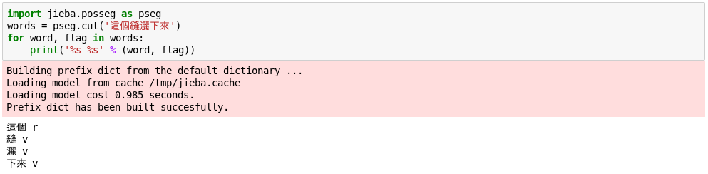
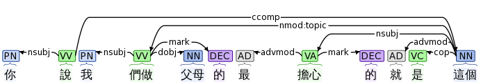
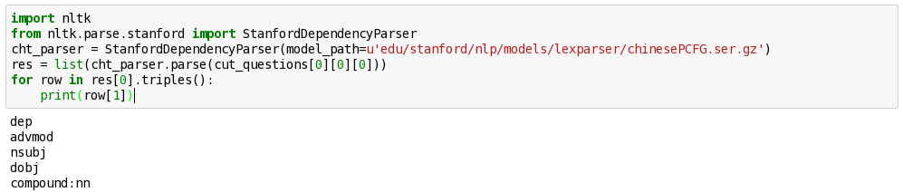
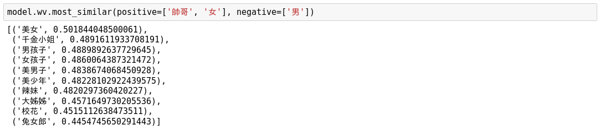
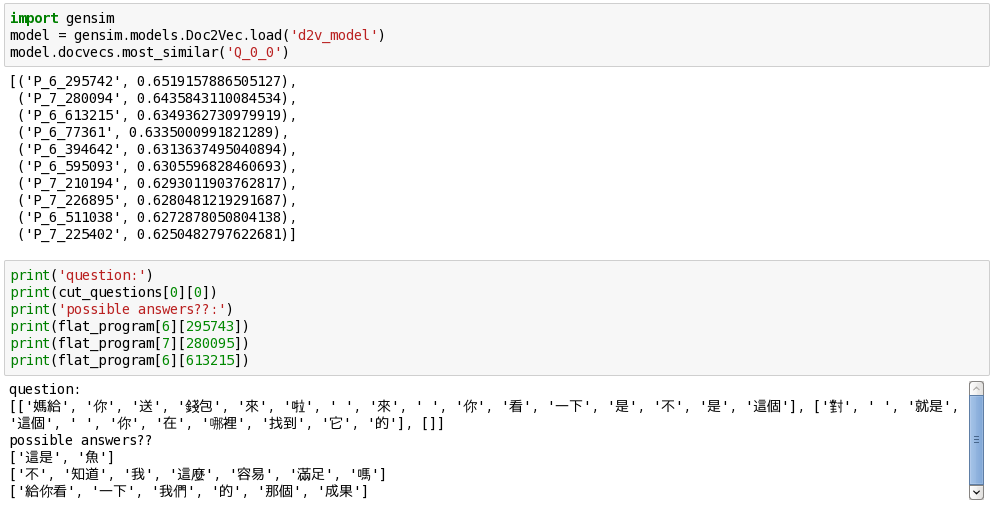
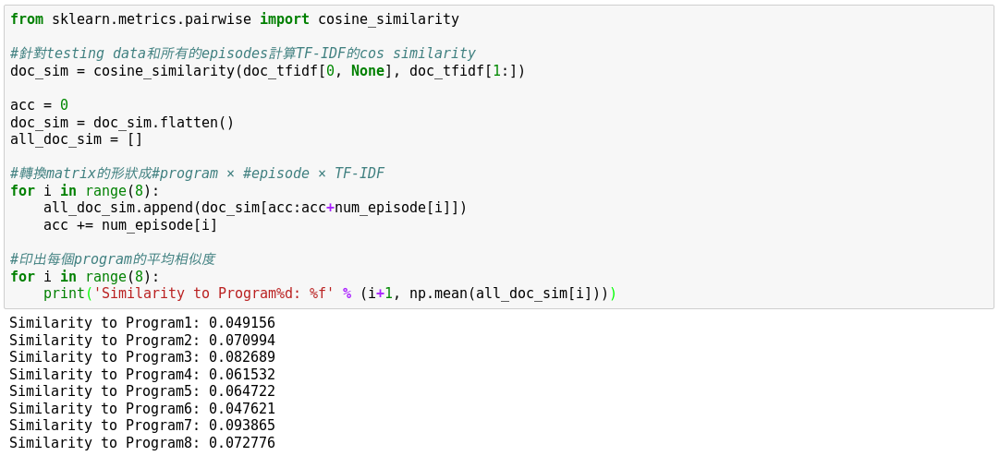
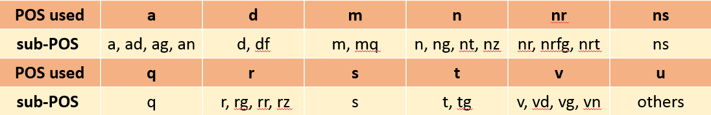
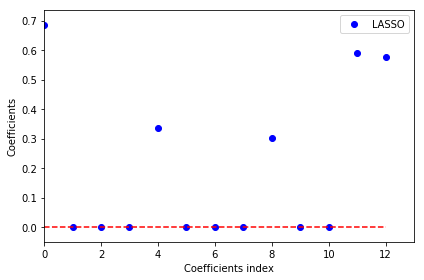
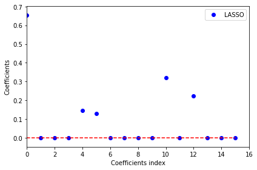
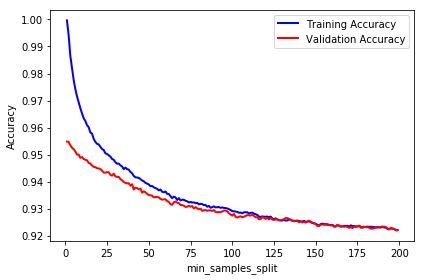

<h1>CS565600 Deep Learning DataLab Cup 1: Predicting Appropriate Response</h1>

<h3>Team22: SkyNet Zero</h3>

### Table of Contents
* [Problem Description](#Problem-Description)
* [Basic Ideas](#Basic-Ideas)
* [Preprocessing](#Preprocessing)
* [Feature Engineering](#Feature-Engineering)
    * [TF-IDF](#TF-IDF)
    * [Part-of-speech Tagging](#Part-of-speech-Tagging)
    * [Dependency Parsing](#Dependency-Parsing)
    * [Hand-picked Keywords](#Hand-picked-Keywords)
    * [Word2Vec](#Word2Vec)
    * [Doc2Vec](#Doc2Vec)
* [Training Data Generation](#Training-Data-Generation)
* [Feature Selection](#Feature-Selection)
    * [TF-IDF](#TF-IDF_S)
    * [Part-of-speech Tagging](#Part-of-speech-Tagging_S)
    * [Hand-picked Keywords](#Hand-picked-Keywords_S)
* [Answer Selection](#Answer-Selection)
* [Result](#Result)
* [Conclusion](#Conclusion)

### Problem Description
這次的作業中，我們要根據題目提供的一串文字(question)中，找出6個options裡面，何者最有可能是題幹的下一句話。

**範例：你最拿手的是什麼菜? A)這你選的耶 B)可愛的小學生 C)炒高麗菜**

根據我們的常識判斷答案應該是C。  

觀察我們的題目，可以發現題目通常由1~3個句子組成，可能是直述句或問句，說話的人可能是同一位或兩到三位；答案的長短則較不一致，通常較長的選項很有可能是答案，經我們測試選最長的選項正確率大概有35%；通常正確選項和題目會有重複的關鍵字，但有時每個選項都有出現關鍵字，太短的答案如「好啊」則和題目完全沒有重複的字。

觀察助教提供的training dataset，由8個不同類型節目組成，每個節目又分成很多集，通常一行只有一句話，可以看出每個文件詞彙的分布其實不太一樣，視節目類型而定。再者，由於training data是節目台詞，因此出現很多不會在testing data中看到的句型，比如說每集節目的開場白與結尾，或鬼打牆連續出現同樣句子的情況，因此可以說training data和testing data在資料分布上其實有一定的bias，並不是那麼容易取得很高的精確度，雖然testing data也有少數一模一樣的句子。

### Basic Ideas
我們對問題主要由兩個方向來著手。一開始誤解了此次作業的目的，一直執著在用之前學過的模型，怕不符合作業要求，所以把所有自己想得到的features餵進各種基本的Machine Learning模型，試圖湊出最好的結果，後來發現這樣做效果都無法大幅提升，最後勉強將精確度提升到48%。但若我們直接用word2vec方式比較question與options的相似度，精確度可以在private data上達到64%，不過由於我們根據public data選擇了一個由Random Forest和word2vec similarity進行Voting的model，雖然看似精準度較高，但事後證明做這種選擇反而造成overfitting。

### Preprocessing
我們使用jieba這個python套件來進行中文的分詞，將原本連在一起的一段文字轉換成一個List of String，總共出現的字有174420個，由於出現太頻繁次的字和太稀疏的字對整段文字的意義不大，因此一般會選取出現次數介於中間的文字，來作為最終學習的辭典，不過經過實驗後發現，像TF-IDF的計算或gensim中word2vec的實作方式，本身就有考慮到詞彙出現的頻率，因此計算feature時，我們沒有拿掉任何stopwords或rare words。

[Back to Top](#Top)

### Feature Engineering

#### TF-IDF
<<<<<<< HEAD
相較於最基本的Bag-of-Words僅計算每個詞彙出現的次數，TF-IDF考慮了每個詞彙出現在所有文件中的頻率，因此直覺上更能反映每個詞彙的重要性。在scikit-learn中，TF-IDF的定義如下：TF為一詞彙在一篇文章中出現的次數，DF則為該詞彙出現在幾篇文章中，為文章總數，因此TF-IDF可以由下列公式計算:  

=======
相較於最基本的Bag-of-Words僅計算每個詞彙出現的次數，TF-IDF考慮了每個詞彙出現在所有文件中的頻率，因此直覺上更能反映每個詞彙的重要性。在scikit-learn中，TF-IDF的定義如下：TF為一詞彙在一篇文章中出現的次數，DF則為該詞彙出現在幾篇文章中，為文章總數，因此TF-IDF可以由下列公式計算:  
>>>>>>> ad6040e95b5f8bde4f506485a9b07e05485dcf76

#### Part-of-speech Tagging
我們認為一句話出現的各詞性數量，一定程度上反映了這句話的意義，比如若問題是「你要去哪裡」，那答案中可以預期會出現一個地名。jieba本身就有提供詞性標注的功能，支援ICTCLAS這個詞性標注集([ICTCLAS的詞性分類]( https://gist.github.com/luw2007/6016931))，可以同時進行斷句與詞性標注。除了一般認知的名詞、動詞外，可以往下細分成人名、地名、動詞、副動詞等等較精細的分類，缺點是Jieba只會根據字典中的預設的詞性來標注，對於中文裡約四分之一的多詞性詞彙無法進一步處理，不過一句話不會同時出現太多這種詞彙，因此影響較小。 範例程式：

#### Dependency Parsing
Dependency parsing可以找出一句話之中，兩兩詞彙之間的關係，一句話的意思不能完全以出現了哪些字來判斷，若能知道這句話的文法架構，詞彙間的主從關係，便能得知這句話想表達的重點為何，例如「我愛你」和「你愛我」的意思並不相同，雖然有出現的詞彙一模一樣。Stanford提供一系列完善的java .jar檔，功能包含tokenization、tagging、parsing等等，我們使用python的wrapper StanfordDependencyParser來為training data標注詞彙關係，詳細的標注方式可以參考Stanford的[論文](https://nlp.stanford.edu/pubs/ssst09-chang.pdf)。  

**圖形化介面：**

  
**實際使用範例：**

#### Hand-picked Keywords
我們認為可以用更直接的方式來產生features，就是直接找題幹的關鍵字，比如說有出現「嗎」通常就會是問句，有出現「可是」通常代表下一句的與題幹意涵是相反的，不過也得小心一些模稜良可的詞彙，比如「哪有」也可能當作反駁的話語而非問句。最後我們小心挑選了以下這些詞彙：「是不是」、「好不好」、「哪」、「呢」、「什麼」、「誰」、「嗎」、「幹嘛」、「吧」、「不」、「怎麼」、「沒」、「可是」、「幾」、「有沒有」來當作features。

#### Word2Vec
我們大量使用了gensim，這一套用於topic modeling的python package，來幫我們產生不少features，在有安裝cython的情況下，更可利用C compiler來加速其training的速度。
word2vec基本上是一個兩層的fully connected network，根據演算法可以細分為CBOW和skip-gram，前者是由上下文來預測缺漏的詞語，後者則由當前詞語來預測前後文的內容。將所有的文件作為training data，word2vec model就可以推斷出詞與詞之間的相關性，training完的hidden layer就成為每個詞彙對應的向量，而越相近的詞語的產生出的向量就會越接近，彼此之間甚至可以有加減法的關係，最後我們使用vector長度400和window大小13作為model的參數，就能產生如下列有趣的例子：

#### Doc2Vec
doc2vec是以word2vec為基礎的方法，再training的時候需要多給每個句子一個paragraph ID，理論上也是根據兩種演算法: Distributed Memory(DM) 和 Distributed Bag of Words(DBOW)，前者是再給定上下文以及paragraph ID去預測詞語的機率，後者則是給定paragraph ID後，去預測詞語的機率；我們本來想透過train好的doc2vec model，以most_similar找出與question最相近的前幾個句子，取得這些句子的下一句vector後，便能透過knn或平均相似度的方式來找出options中哪個答案最有可能，不過我們發現doc2vec不但要train比較久，找出來的句子以肉眼觀察也沒什麼相關性。如下圖所示：

[Back to Top](#Top)

### Training Data Generation
這個部份針對我們使用傳統的classification方法來做討論，我們發現若像助教範例中，將連續兩句資料的features串接在一起，效果並不是很好；因為testing data的題幹通常也是由兩三句話組成，且每具都有一定的長度，所以我們採用下列兩種方法：
1. 針對positive label的data，將連續幾句話的features做平均，如此讓資料可以看到前後幾句，比較能抓到句子的意思，但使用這種方法的副作用是很容易overfit，在validation set上可以達到大於90%的正確率，testing set上則只能達到一半左右
2. 我們在隨機產生training data的過程中刻意剔除掉比較短的句子

**我們使用的程式碼如下：**

    #製造positive label的資料
	if pos_or_neg!=0:
        episode_id = random.randint(0, len(program_tfidf)-1)
        line_id = random.randint(0, len(program_tfidf[episode_id])-9)
		
		#用前五句話與後三句話的平均，製造TF-IDF feature
        tfidf_avg = np.mean(np.asarray(program_tfidf[episode_id][line_id:line_id+5]), axis = 0)
		tfidf_next_avg = np.mean(np.asarray(program_tfidf[episode_id][line_id+5:line_id+8]), axis = 0)
		
        #我們所有的features都有經過normalization
        if np.linalg.norm(tfidf_avg) != 0:
            tfidf_avg = tfidf_avg/np.linalg.norm(tfidf_avg)
        if np.linalg.norm(tfidf_next_avg) != 0:
            tfidf_next_avg = tfidf_next_avg/np.linalg.norm(tfidf_next_avg)
        
		#若選到到長度太短的句子，必須重選
        while np.mean(np.asarray(program_len[episode_id][line_id:line_id+5])) < 4:
            line_id = random.randint(0, len(program_tfidf[episode_id])-9)
            
**由於使用整個dataset來training會花太多時間，我們採用不同的方式來從抽樣，並比較不同的選法的效果：**
1.	全部用同一個program產生的資料
2.	隨機從所有programs中抽取任意數量episodes
3.	針對所有的episodes與testing dataset計算TF-IDF，並給定一個門檻，選取與testing data相似度高於此門檻的所有episodes
4.	使用以上幾種選法，不過改變training data的數量

**比較相似度的程式碼片段:**

由上述結果發現與testing data最相似的是program 7，然而試過所有前述方式後，我們發現各個表現都差不多，即使用更多的資料來進行training精準度也不一定較高，我們認為可能是因為dataset中的noise過多，導致增加data無法提供model更多的資訊；也有可能是我們使用的model capacity不夠，改用NN類的方式可能會有更好的結果。

[Back to Top](#Top)

### Feature Selection
雖然前面列了許多我們想到的features，但最後我們發現Doc2Vec效果並不如Word2Vec，而Dependency Parsing又須要花大量時間才能產生所有feature，最後我們來不及嘗試，所以實際training僅有使用其他features。

#### TF-IDF
我們使用scikit-learn中的TfidfVectorizer，針對每一個episode與testing data，以句子作為document的單位，來計算詞彙的TF-IDF vector，並選取前30個最重要的詞彙作為feature。若我們直接拿testing data的question與options進行cos similarity的比較，其實就能達到45%的精準度，不過我們發現，若將前後句的TF-IDF vector進行內積，轉換成一個一維的feature，加上其他features後可以透過training的方式再提升精準度。

    tfidf = TfidfVectorizer(ngram_range=(1,1), max_features=30)
    

#### Part-of-speech Tagging
由於ICTCLAS全部的詞性多達五十幾個，很多過細的分類其實是不必要的，我們將相近的詞性分在一起，最後選出11大類，第12類u(unknown)則代表無法被分到前面任一組別的詞性，對應方式如下表所示，sub-POS都會被歸類到其上方的類型一起統計。

我們以每個詞性出現的次數來當作一個句子的feature，並透過課程中教過的方式，使用Lasso來選出最有用features，從下圖中可以看到，當alpha=0.05時，除了第0個feature是TF-IDF外，可以選出第3, 7, 10, 11，分別對應n, r, u, v等詞性，作為最後使用的features。

#### Hand-picked Keywords
使用方式和POS Tagging大同小異，差別我們選取的主要是Question的關鍵字，因此只須把前一句的features放進來train，而不需要將前後兩句都放進來。根據下圖LASSO的結果，我們選擇了第3, 4, 9, 11，分別對應「呢」、「什麼」、「不」、「沒」等字的出現字數。

**我們最後使用的features**

    feature = (tfidf_avg.dot(tfidf_next_avg), qword_avg[[3, 4, 9, 11]], 
        tag_avg[[3, 7, 10, 11]], tag_next_avg[[3, 7, 10, 11]])       
    Xs.append(np.hstack(feature))
    Ys.append(1)
    
[Back to Top](#Top)

### Answer Selection
**Traditional Classification**  
我們將每個question分別和6個options組合成6筆testing data，並使用各種train好的scikit-learn models來進行prediction。透過predict_proba我們可以得到每個句對是連續句子的機率，因此我們只要選其中機率最大者作為我們的答案即可。

**word2vec Comparison**  
由於word2vec產生的向量是針對每個詞彙，要得到句子的向量，我們需要找出所有出現在句中的詞彙向量，再取他們的平均，接著比較question對每個options的cos similarity，選出相似度最高者。

[Back to Top](#Top)

### Result
**Traditional Classification**  
不斷測試後發現Random Forest不但跑得速度比較快，精準不也不會比SVM(rbf)等其他model差，因此我們主要以它來進行實驗。透過調整RandomForestClassifier 的min_samples_split參數，我們可以設定每個leave上至小於幾個資料點時，就必須停止分支下去，數值越大就代表分得越粗糙，overfitting的可能性就越小，調整此hyperparameter我們可以得到以下圖表，其中x軸的值必須乘上：

可以發現折線圖的表現和我們預期中一模一樣，但無論我們怎麼調整min_samples_split比例，現在最後testing data上的表現都並非嚴格遞增或遞減，而是有點隨機的現象，因此我們無法由Error Curve來進行model的選擇。由於這次的testing set大家都能隨時測試，所以變成我們只能根據public data來調整參數，但風險就是overfitting的機率非常高，最後我們靠此model可以達到48%的準確度。  

**word2vec Comparison**  
直接套用word2vec model就能在private dataset達到64%的精準度，雖然因為它在public dataset表現較差，僅有60%，導致我們並沒有選擇它作為我們的submission。  

**Voting**  
在許多testing data上我們前兩個model的判斷是不一樣的，比如說第一筆資料通常是Random Forest正確，word2vec錯誤，於是我們就嘗試了各式各樣的組合方式上傳，事後證明這是個不好的方法，最後很容易產生overfitting。

[Back to Top](#Top)

### Conclusion
這次的競賽我們學習到不少關於自然語言處理的技巧，像是用tokenization、stopwords elimination等等，都是以前不曾接觸過的；並學習如何將原本以文件形式儲存的raw data，使用各種encoding的方式轉換成 vector的形式，以利一般的machine learning演算法使用；此外還必須透過feature engineering的技術來找出可用的features，剔除不必要的資訊，以讓我們的training過程更有效率。  
但因我們前期專注在找尋features上，以及探索這學期上過的何種classification架構較好，導致我們很晚才嘗試直接比較句子相似度等方法，真的沒想到word2vec的效果過出乎意料的好。雖然這次我們在public data的上有64%的準確度，但在private公布後，竟然只剩下59%，反而是一些沒被我們選上的model表現較好，讓我們深深體會到overfitting的後果。  
最後，在聽完前幾名的組別分享後，我們認為以下幾點是我們之後可以改進的方向：  
1.	在jieba斷詞時，時常會切出一些奇怪的新詞，例如:「媽給」等等，但我們卻沒發現是因為演算法中使用HMM會去判斷新的詞語，只要將其改為false，或是換一個更好的切詞工具，就能解決此問題
2.	在這次的data中，其實有不少無法正確處理的字元，這些都會影響到結果，我們並未將這些字元刪除
3.	我們本來利用word2vec來計算整個句子的vector的時候，也有加上TF-IDF的權重，不過實驗之後準確度沒有比較高，不知道是否因為我們TF-IDF只針對整個testing data去做計算的原因
4.	計算cos similarity的時候必須以絕對值來做評估，才不會忽略一些實際上有負相關性的句子
5.	助教有提到可以先用刪去法刪去一些不可能的答案，再用較精確的model來做從剩下的答案做選擇，我們實驗時僅用肉眼觀察最後的結果，導致我們當初沒有發現任何規律，是未來值得思考的方向

[Back to Top](#Top)
