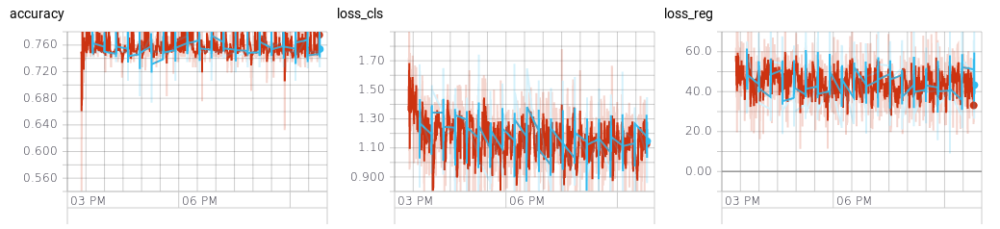

<h1>CS565600 Deep Learning DataLab Cup 2: CNN Object Detection</h1>

<h3>Team22: SkyNet Zero&nbsp;&nbsp;&nbsp;&nbsp;&nbsp;</h3>

### Table of Contents

* [Problem Description](#Problem-Description)
* [Source Code Description](#Source-Code-Description)
* [Data Exploration](#Data-Exploration)
* [First Thoughts](#First-Thoughts)
* [Preprocessing](#Preprocessing)
    * [Image](#Image)
    * [Scaled RoI & Box Index](#Scaled-RoI-Box-Index)
    * [Regression Target & Labels](#Regression-Target-Labels)
* [Network Architecture](#Network-Architecture)
    * [VGG16](#VGG16)
    * [RoI Pooling](#RoI-Pooling)
    * [Loss Computation](#Loss-Computation)
    * [Overall Architecture](#Overall-Architecture)
* [Non Max Suppression](#Non-Max-Suppression)
* [Experiments](#Experiments)
    * [Class Balancing](#Class-Balancing)
    * [Learning Rate Tuning](#Learning-Rate-Tuning)
* [Result](#Result)
* [Conclusion](#Conclusion)

### Problem Description
這次作業主要處理的是視覺辨識中的Object Detection問題，給定一張圖片，我們必須找出圖片中所體所在的位置與該物體屬於的類別。然而一張圖可能會有很多大小不一的物體，各種物體彼此又有可能會重疊、覆蓋，造成此類問題更加的複雜，若要將這項技術運用到自駕車等即時系統上面，更得考慮運算時間的問題，才有實質效益。

### Source Code Description
* DL_comp2_22_report.ipynb: 現在這個Report檔
* DL_comp2_22_report.html: 方便閱讀
* Main.ipynb: 拿來讀取資料、資料處理、Training、Testing與各種主要的功能
* [Vgg.py](https://github.com/tensorflow/models/blob/master/research/slim/nets/vgg.py): 直接使用Tensor Slim中的VGG，但把第五層Max Pooling改為tf.image.crop_and_resize或RoI Pooling
* bbox_transform.py: 一些常用計算Functions，包括原本助教提供的bbox_transform、reg_to_bbox；計算兩兩Boxes之間IoU的bbox_overlaps，與nms
* Regression Stats.ipynb: 拿來計算所有Regression Target的Mean與Standard Deviation
* Best.csv: 我們最後最好的結果，平均Error Rate約0.6
* Log.txt: 一些有存下來的Console Output
* \__init__.py
* images/: 存放所有DL_comp2_22_report.ipynb中用到的圖片

### Data Exploration
我們使用的是Pascal VOC 2012的dataset，VOC 2012包含4大類共20種物體:
* Person: person
* Animal: bird, cat, cow, dog, horse, sheep
* Vehicle: aeroplane, bicycle, boat, bus, car, motorbike, train
* Indoor: bottle, chair, dining table, potted plant, sofa, tv/monitor

這次我們使用了其中10398張圖片，我們先稍微觀察了一下數據分布，可以看出人的出現頻率特別高；此外每張圖片裡大部分的物體數量；此外每張圖片裡大部分的物體數量都不超過25。
&nbsp;  

&nbsp; 

### First Thought
根據[Speed/accuracy trade-offs for modern convolutional object detectors](https://arxiv.org/pdf/1611.10012.pdf)中的比較圖，我們可以發現Faster RCNN算是比較精確的模型，相較於其他比較新的架構如SSD、YOLO雖然速度快許多但精確度並不一定較高。而由於這次作業已經預先提供許多Regions of Interest (RoIs)，等於不一定要使用End-to-End的架構，因此最後我們選擇使用較簡單，精確度理論上又不會太低的[Fast RCNN](https://www.cv-foundation.org/openaccess/content_iccv_2015/papers/Girshick_Fast_R-CNN_ICCV_2015_paper.pdf)來實作。

<\p

[Back to Top](#Top)

### Preprocessing
我們Training所需要的Inputs主要有下列幾個，沒特別說明的話都是按照原Paper的參數設定。除了Image我們使用Dataset API來進行處理外，其餘Inputs都是由我們的get_ground_truth將dataframe轉換成我們需要的格式。

#### Image
我們將所有的Image統一縮放到500×500，因此圖中的RoIs和Ground Truth Bounding Boxes (GT BBoxes)也必須等比例縮放，接著因為我們使用Pretrained好的VGG Weights，因此必須將原本分布於[0, 255]的每個像素分別根據其所在Channel減去RGB的平均值: 123.68, 116.779, 103.939，以符合Pretraining時的資料分布，根據Paper我們Batch Size為2張圖片。

#### Scaled RoI & Box Index
我們基本上是以一個RoI為單位來進行Training，每張圖片會隨機抽出64個RoIs，其中約25%屬於Foreground，代表這些RoIs中是有物體的，75%屬於Background，代表這個框裡面沒東西，而判斷有沒有物體的根據是Intersection over Union (IoU)，也就是RoI和GT Bounding Box的重疊區域除以兩者覆蓋區域。我們以IoU>=0.5的RoI作為Foreground，0.5>IoU>0.1作為Background，不選擇那些IoU<0.1的區域，是因為我們希望Training Data越難越好，這樣最後的模型才會比較能區別分這兩者差別。實際上在抽樣的時候會發現有些圖片根本沒有Foreground Region，甚至Background Region，比如第316和 3792張圖，因此我們會先將這兩張剔除。

選出要使用的RoIs後，我們必須將RoI的座標傳給我們的模型，用來在最後一層Convolution Feature Map上選擇要進行RoI Pooling的區塊。由於Tensorflow使用的參數通常是先高再寬，因此X、Y軸座標需先行調換。若使用助教提供的RoI Pooling API，我們必續傳入在Feature Map上的RoI的原始座標(例如VGG16就會從[0, 499]縮放到[0, 30]之間)；若使用Tensorflow內建的tf.image.crop_and_resize，我們則須傳入Normalized到\[0, 1)之間的座標。由於我們使用的Batch Size大於1，因此需要額外的Box Index拿來選擇RoI要跟哪一張圖進行Pooling，因此最後的資料可能會像下面這樣:

Scaled RoIs (106, 4):

    [[ 0.07219251,  0.25450903,  0.61229944,  0.84368736],
     [ 0.05614973,  0.        ,  1.        ,  1.        ],
     [ 0.        ,  0.        ,  0.63101602,  0.84769541],
     ...,
     ...]]
     
Box Indices (106,):

    [0, 0, 0, 0, 0, 0, 0, 0, 0, 0, 0, 0, 0, 0, 0, 0, 0, 0, 0, 0, 0, 0, 0,
     0, 0, 0, 0, 0, 0, 0, 0, 0, 0, 0, 0, 0, 0, 0, 0, 0, 0, 0, 0, 0, 0, 0,
     0, 0, 0, 0, 0, 0, 0, 0, 1, 1, 1, 1, 1, 1, 1, 1, 1, 1, 1, 1, 1, 1, 1,
     1, 1, 1, 1, 1, 1, 1, 1, 1, 1, 1, 1, 1, 1, 1, 1, 1, 1, 1, 1, 1, 1, 1,
     1, 1, 1, 1, 1, 1, 1, 1, 1, 1, 1, 1, 1, 1]

由於我們將每個Batch中的資料串接再一起，因此每個Batch產生的資料長度可以不同(有可能一張圖中找不到64個RoIs)。

#### Regression Target & Labels
接著我們需要為每個RoI標上正確的Ground Truth資訊，Label基本上就是和每個RoI IoU最大的GT BBoxes所屬類別，額外用0來代表Background的RoI；Regression Target代表我們的RoI需要經過怎樣的轉換才會和GT Box一模一樣，在這裡我們並不是單純用XY軸方向的差距來當作Target，而是使用中心點的位移，和長寬的縮放的比例，如此可以降低RoI大小的影響，避免越大的RoI所需要的位移也越大；此外長寬的縮放還需要取Log值，如此可以降低縮放在整個Loss中所佔的權重，畢竟位置對正確性的影響較大。
進行Testing時，每個餵入模型RoI對每個Class都會產生一組BBox Prediction，畢竟每個類型的物體長寬比例都有一定的規律，必須分開學習，因此Regression Target應該有4×20個元素，所以我們必須將算出來的GT BBox放在對應的位置，其他的位置都設為0。最後，我們用預先計算好的Regression Target平均值和標準差來做Normalization，一樣將X、Y軸座標進行調換。

Regression Targets (106, 80):

    [[0, 0, 0, 0, 0, 0, 0, 0, 0, 0, 0, 0, 0, 0, 0, 0, 0, 0, 0, 0, 0, 0, 0,
      0, 0, 0, 0, 0, 0, 0, 0, 0, 0, 0, 0, 0, 0, 0, 0, 0, 0, 0, 0, 0, 0, 0,
      0, 0, 0, 0, 0, 0, 0, 0, 0, 0, 0, 0, 0, 0, 0, 0, 0, 0, 0, 0, 0, 0, 0,
      0, 0, 0, 0, 0, 0, 0, -1.16299191,  3.01151426, -0.80252906,  1.92758439],
      ...,
      ...,
      ...]]
     
Labels (106,):

    [20, 20, 20, 20, 20, 15, 20, 20,  5, 20,  5, 15, 20, 20, 15, 15, 20,
     20, 20, 15, 20, 20,  0,  0,  0,  0,  0,  0,  0,  0,  0,  0,  0,  0,
      0,  0,  0,  0,  0,  0,  0,  0,  0,  0,  0,  0,  0,  0,  0,  0,  0,
      0,  0,  0, 12, 12, 12, 15, 12, 12, 15, 12, 15, 12, 12, 12, 12, 15,
     15, 15, 15, 12, 12, 12,  0,  0,  0,  0,  0,  0,  0,  0,  0,  0,  0,
      0,  0,  0,  0,  0,  0,  0,  0,  0,  0,  0,  0,  0,  0,  0,  0,  0,
      0,  0,  0,  0]

[Back to Top](#Top)

### Network Architecture

### VGG16
我們整個Fast RCNN中的CNN架構是使用VGG16，基本上VGG只是不斷的進行3×3的Convolution，並透過5次Max Pooling較低Feature Map的大小，最後接上Fully Connected (FC) Layers來進行分類。  
  
由於在我們實驗室的工作站上已經有之前學長下載好的ImageNet ILSVRC2012的Dataset，以此我們就直接拿來使用。ImageNet的圖片都已被轉成TFRecord的形式，其優點在於他能將Image與Label統一儲存，更好地利用記憶體，加快資料流的速度，以增進Training效率。
只要先設定好相關資料所在的路徑，便可以用Tensorflow寫好的[train_image_classifier.py](https://github.com/tensorflow/models/blob/master/research/slim/train_image_classifier.py)來進行Training，不過得根據自己的模型調整各種Hyperparameters，以下是我們使用的設定：      

執行後每隔一段時間就會產生checkpoint，如此我們便能將Variable Weights讀到Tensorflow Slim底下的VGG模型中，但要達到最理想的精準度太花時間了，因此我們只Train了兩天的時間就直接來拿來使用，但經過約400000個iterations後，Loss從最初的7點多掉到2點多，執行[eval_image_classifier.py](https://github.com/tensorflow/models/blob/master/research/slim/eval_image_classifier.py)的Top-1 Accuracy可以到達0.5以上。

### RoI Pooling
Fast RCNN把VGG16中第5次的Max Pooling拿掉，取代為RoI Pooling，因此我們的Feature Map大小縮小了倍。RoI Pooling會從Feature Map中選取RoI在原圖中等比例縮放後的區域，再將該區域平均分割成塊區域(我們使用7×7)，最後只保留每塊區域中最大的值。利如下圖即為各種大小的情況：

這裡我們有兩種實作方法，一是採用別人寫好的[Roi Pooling Operation](https://github.com/deepsense-ai/roi-pooling)，另外也可以使用tf.image.crop_and_resize，但後者比較不一樣的地方是Resize選取區塊後的每個像素，是由Bilinear Interpolation的方式來取得，感覺和Mask RCNN的RoIAlign方法比較像；兩者輸出Tensor的Dimension順序也不太一樣，假設原本Input大小為，我們總共有R個RoIs ，Roi Pooling的輸出是，crop_and_resize則是。

### Loss Computation
RCNN的特點之一：Multi-Task Loss，讓我們可以一次針對兩個問題進行最佳化。RoI Pooling完後會先經過兩層FC Layers，在這裡我們除了要把原本做Classification的Layer改為21個類別的分類器，還需額外一層FC Layer來進行BBox Regression，比較特別的是，我們使用的是Smooth L1 Loss而非一般Linear Regression使用的L2 Loss，觀察這兩種Loss可以得知，當預測值離正確值越遠時，L2 Loss的斜率會一直增加，Smooth L1 Loss則維持在，如此可以避免Backpropagation產生Gradient Explosion的問題。實作上我們傳進的Regression Target只有在Ground Truth Label所屬的4個連續位置絕不是0，其他屬於Background的RoI都是0也沒有定義GT BBox，因此我們可以用tf.where，針對非0的位置進行計算就好。  

### Overall Architecture
我們整體的架構可以用Tensorboard來觀察。

[Back to Top](#Top)

### Non Max Suppression
當我們將Testing的資料餵進模型後，可以得到這個RoI屬於每一個類別的機率分別是多少，和針對這些物體要做怎樣的轉換，得到的BBox才能更精確地框在物體上，此時我們就必須要從幾百個BBoxes中，篩去大小不合理的、機率太小的，或重複預測同一個物體的RoIs。
首先我們進行初步的篩選，我們先找出每個Class在所有Image的所有BBoxes中出現的機率，我們假設總數不會超過40000個，於是我們可以將所有的機率進行排序，並將分數太低的那些BBoxes剔除；接著我們假設一張圖不可能出現太多物體，所以每張圖最多只保留100個Boxes，以上這些參數都是Hyperparameters。
刪去大部分的RoIs後，我們便能進行計算複雜度很高的NMS，來將太相近的BBoxes剔除，NMS的原理其實就是一種Greedy的演算法，拿來刪除對同一個物體太多重疊的框。我們會從機率最高的框開始找起，將它保留下來，並把其他所有和它IoU超過一定Threshold的BBoxes刪除，接著找剩下的BBoxes中機率最高者，一值不斷重複下去，最後回傳要保留的BBox Indices，這個過程是針對每個類別都必須進行一次。
最後根據一開始的觀察，我們將大小過小(小於100)的BBoxes刪除，將小於一定機率(約0.6上下)的BBoxes刪除，若所有的BBoxes都被刪光了，我們就重新從圖中所有的Prediction選出機率最高者，因此我們至少留有一個框在圖中。

### Experiments
我們使用的Hyperparameters如下，除了Baseline的Learning Rate為0.0001外，其餘都和原Paper相同；我們都只用Pretrained好的VGG16 Weights，包括FC6與FC7；並Finetune Conv3_1之後的Layers;使用的顯示卡為GTX 1080Ti。

| Hyperparameter   | Value           | Hyperparameter    | Value           |
| ---------------- | --------------- | ----------------- | --------------- |
| Batch Size       | 2               | Reg. Init. STDEV  | 0.01            |
| Input Size       | 500×500         | Cls. Init. STDEV  | 0.001           |
| RoI Pooling Size | 7×7             | Optimizer         | Adam            |
| Max RoIs/Batch   | 64              | Learning Rate     | 0.0001          |
| Dropout Rate     | 0.5             | LR Multiplier (W) | 1               |
| Weight Decay     | 0.0005          | LR Multiplier (b) | 2               |
| FC Initializer   | Gaussian        |                   |                 |

#### Class Balancing
由於我們一開始用比較少量的資料進行測試時，發現由於Person的數量特別多，導致完成Training後常常發生模型把所有的物體都分成Person的現象，因此我們有測試另外一種RoIs取樣的方式，我們會根據每個類別的出現頻率，來調整他們被選到的機率，實作上我們會先選50%的Foreground RoIs，再隨機從中刪除掉一部分，這樣Person被抽到的機率就會少非常多，可以讓Training時的資料分布較平均，且Foreground和Background的比例仍維持在1:3左右。

#### Learning Rate Tuning
我們一開始在資料量較大的時候都Train不太起來，雖然用的Hyperparameters和原Paper都一模一樣，但是Loss經過一兩個Epochs之後就會爆炸或是根本無增無減，檢查Regression結果會發現每個RoI輸出的值都一模一樣，把Weights拉出來看才發現原來發生了Dying ReLU的現象，也就是因為Backpropagation的Gradient過大，把Weights都設成很小的值，導致之後ReLU輸出的值都變成0，最後我們採取的解決方式是將Learning Rate調到0.0001，也就是Paper使用的十分之一，就解決了這個問題，網路上也有查到可以改用Leaky ReLU或ELU等Activation Function，讓Gradient在負的地方仍會有值。此外我們也發現使用tf.image.crop_and_resize比較不容易產生此現象，相對地若要用RoI Pooling，就得使用更低的Learning Rate。

[Back to Top](#Top)

### Result

1. Baseline:  
    Baseline: 花了5h 24min 37s Train了20個epochs後，Training Loss從Cls: 1.15849209, Reg: 41.9974823降到Cls: 0.82245922, Reg: 14.22667694，最後得到的分數約0.64。  
    &nbsp;  
2. Baseline + Class Balancing:  
    Baseline + Class Balancing: 花了2h 18min 40s Train了7個epochs後，Training Loss從Cls: 1.63010526, Reg:57.77796936降到Cls:0.79456723, Reg:36.50595856，可以注意到Classification的Loss下降快非常多，不過Regression下降的幅度反而較低，不過在後續的Training當中精準度都有漸漸提高，最後經過412748個Iterations後Loss變為Cls:0.83267421, Reg: 3.00880456，最後得到的分數約0.60，比我們在截止日前上傳的還要稍微好一些。下面秀出幾個比較好的結果，可以發現就算同時有許多的物體靠在一起，我們的模型仍能將它們區分開來。  

至於判斷錯誤的圖片，我們觀察到通常會錯的可能是彼此有相關性的類別，比如貓和狗和其他動物，或是長得像動物的人；不過有時候仍會發生預測一大堆Person的現象，代表可能仍然有Overfitting的現象發生；另外由於Training時長形的圖片較多，高達8299張，造成Testing時高形的圖片很也容易分錯，不過即使有些BBox分類錯誤或是根本沒圈到物體，我們還是可以看出物體的形狀有被學習到，比如aeroplane, dining table就會是扁長形的, person, bottle就會是瘦高形的等等。  

&nbsp;  
3. Baseline + FC6, FC7 Trained From Scratch
    我們將後面兩層FC Layers改成重新初始化(使用預設的Xavier Initialization)從頭開始Train，Weight Decay一樣使用0.0005，花了9h 41min 12s Train了20個epochs後我們發現一個特別的現象，雖然Training Loss不斷降低，但是Validation Loss幾乎都不會下降，不過最後視覺化得到的結果BBox仍能非常精確地圈出物體，不過卻很容易猜錯框中的物體類別，下面是我們用Tensorboard觀察Loss與Accuracy(針對每個RoI進行Classification)變化的結果。  

4. Baseline + RoIPooling + Learning Rate 0.00008
    最後我們仍想試試RoI Pooling能否成功，花了6h 26min 8s Train了20個epochs後，Validation Loss從Cls: 1.2873522, Reg: 47.27973938降到Cls: 1.13122988, Reg: 45.45677567 不過最後發現這個設定還是爆炸了，最後都只會在圖片右下角預測出Person。

### Conclusion
這次競賽讓我們學到許多Tensorflow特別的用法，包括Dataset的使用、Tensorboard的Visualization等等，且若想進行一些Deep Learning實驗 Tensorflow也非常適合，其語法不但和Numpy非常相像，若想對Network進行微調也很方便，包括可以針對每一層設定Learning Rate，或是決定哪幾層要Freeze住不要進行Weight Update等等，Checkpoint也讓我們可以不必擔心電腦當機等問題。  
其實這次我們本來想實作Faster RCNN，雖然簡單來說它只比RCNN多了RPN Network，但直接看原作者的Code實在是難以理解，因此就從比較容易的Fast RCNN開始做起，也發現光看Paper其實很難了解許多實作的細節，包括參數的設定、資料的格式等等，必須參考許多網路的資料。即便最後覺得自己所有的參數環境弄得和作者都一樣了，Train出來的結果還是不甚理想，由於我們使用更低的Learning Rate來避免Dying ReLU，但這樣要花更久的時間Loss才會收斂。不過最後的準確度也沒有到Paper中描述的，0.60和前幾名同學一樣用Fast RCNN的0.29還是有段差距，猜測可能是因為我們Pretrained的模型並沒有我們想像中的那麼精準，導致Initial Weights並不是很理想；或嘗試的Hyperparameter組合不夠多導致錯過精準度最高的那個點；當然也有可能是實作上還有一些小Bug，希望之後不會再犯一樣的錯誤。

[Back to Top](#Top)
