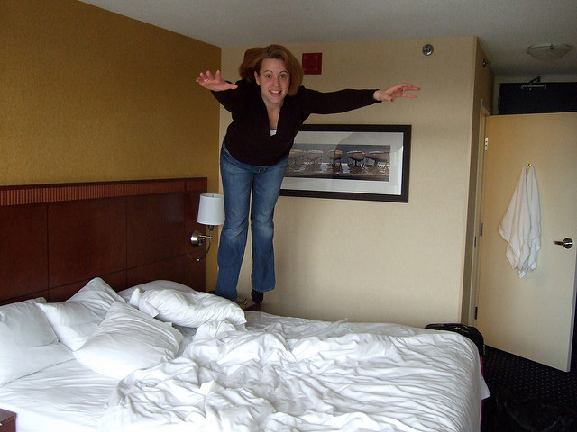
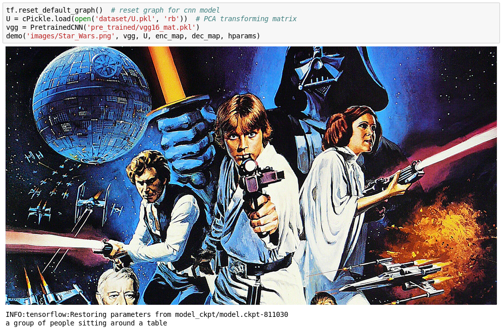
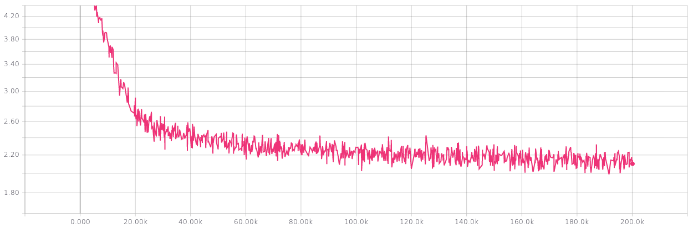

<center><h1><span style="color: #f2cf4a; font-size: 1.2em; line-height:40px">CS565600 Deep Learning<br/>DataLab Cup 3: Image Caption</span></h1></center>
<center><h3>Team22: SkyNet Zero&nbsp;&nbsp;&nbsp;&nbsp;&nbsp;Members: 105062635 吳浩寧 105062514 張嘉宏</h3></center>
<a id='Top'></a>
### Table of Contents

* [Problem Description](#Problem-Description)
* [Source Code Description](#Source-Code-Description)
* [Data Exploration](#Data-Exploration)
* [Preprocessing](#Preprocessing)
    * [Image](#Image)
    * [Text](#Text)
* [Network Architecture](#Network-Architecture)
    * [RNN Cell](#RNN-Cell)
    * [Attention](#Attention)
* [RNN Techniques](#RNN-Techniques)
    * [Gradient Clipping](#Gradient-Clipping)
    * [Curriculum Learning](#Curriculum-Learning)
    * [Beam Search](Beam-Search)
* [Experiments](#Experiments)
    * [Setup](#Setup)
    * [Evaluation](#Evaluation)
* [Result](#Result)
    * [Choice of Cell](#Choice-of-Cell)
    * [Incremental Test](#Incremental-Test)
    * [Arbitrary Images](#Arbitrary-Images)
    * [Beam Search Tuning](#Beam-Search-Tuning)
* [Conclusion](#Conclusion)

<a id='Problem-Description'></a>
### Problem Description
這次作業我們要實作Image Captioning，給我們一張圖片，我們要透過RNN系列模型產生一行文字，來描述圖片的內容，文字內容包含圖中出現了那些物體、物體的特性、物體的動作、物體之間彼此的關係等訊息，由於RNN可以學習輸入在各個時間上的變化，像FSM一樣根據過往的紀錄來決定下一個輸出，因此特別適合用在此類問題上。

<a id='Source-Code-Description'></a>
### Source Code Description
* DL_comp3_22_report.ipynb: Report檔
* DL_comp3_22_report.html: 建議助教閱讀此檔!!! 圖片好像有時怪怪的...
* Main.ipynb: 拿來讀取資料、資料處理、Training、Testing與各種主要的功能
* result/: 存放實驗結果
* images/: 存放圖片
* model_ckpt/:存放Train好的checkpoint

<a id='Data-Exploration'></a>
### Data Exploration
我們使用的是Microsoft COCO 2014的dataset，物體可以大致分為以下12大類：Outdoor, Food, Indoor, Appliance, Sports, Person, Animal, Vehicle, Furniture, Accessory, Electronic, Kitchen。由於描述一張圖片有很多種方法，因此我們需要每張圖已經標示好的5句話作為我們的Ground Truth Labels，每句話和圖片組合起來就是一筆Data。  
我們使用了其中102739張圖片，我們先稍微觀察了一下句子長度數據分布，可以看出句子長度主要都集中在8~10左右，觀察每個句子的格式，可以發現幾乎都由名詞起頭，前面通常還會加個不定冠詞a或an；針對一張圖的5個句子，出現的名詞順序有可能不同，但有出現的名詞幾乎都是一樣的，雖然有時同類物品會被標注成集合名詞如food或furniture等等，有人在內的圖片看起來是最多的。

[Back to Top](#Top)

<a id='Preprocessing'></a>
### Preprocessing
<a id='Image'></a>
#### Image
1. Center-Cropping
2. Resizing to 224×224
3. Compress Pool5 feature to 256d with PCA
4. Per image standardization

<a id='Text'></a>
#### Text
1. Append start and end tokens before and after a sentence
2. Convert word to ID according to dataset/text/vocab.pkl  
   E.g. one of the caption from 536654.jpg:  
   three women wearing hats at a table together→\[0, 1547, 1106, 1129, 1387, 1589, 2045, 1514, 581, 1\]
3. Look up [GloVe's](https://nlp.stanford.edu/projects/glove/) word embedding pretrained on Wikipedia 2014 & Gigaword to get 300d word vectors
4. Compress feature to 256d with PCA

<a id='Network-Architecture'></a>
### Network Architecture
<a id='RNN-Cell'></a>
### RNN Cell
我們使用Tensorflow的BasicLSTMCell作為我們基本的構成元件，並使用DropoutWrapper，它會在每個Cell的Input、Output、H State Output加上Dropout。  
為了增加我們架構的Capacity，我們有使用MultiRNNCell來增加Layers數量，但比較麻煩的是由於LSTM本身回傳的State為LSTMStateTuple，加了MultiRNNCell後回傳的值變為Tuple of LSTMStateTuple，例如三層的State Tuple: (LSTM(c, h), LSTM(c, h), LSTM(c, h))，因此分成一個個Steps執行時要先將每筆Data的所有States串接起來，處理比較方便，處理完則得拆成原本的格式以餵入下一個Time Step。


```python
def get_a_cell():
    cell = tf.contrib.rnn.LayerNormBasicLSTMCell(num_units=self.hps.rnn_units)
    if self.mode == 'train':
        cell = tf.nn.rnn_cell.DropoutWrapper(cell, self.hps.drop_keep_prob, self.hps.drop_keep_prob)
    return cell
rnn_cell = tf.contrib.rnn.MultiRNNCell([get_a_cell() for _ in range(self.hps.rnn_layers)], state_is_tuple=True)
```

<a id='Attention-Layer'></a>
### Attention Layer
我們參考[Show, Attend and Tell](https://arxiv.org/pdf/1502.03044.pdf)的架構(下圖)來實作一個簡化版本的Attention機制。
  
由於我們使用的圖片輸入並非原文中未壓縮前的整層Feature，而是經過PCA壓縮過的一維向量，所以無法直接移植過來，我們的Attention機制如下：將最後一層LSTM的H State和圖片Feature f，各自傳過一層Affine Layer後的結果相加，經過ReLU和另一層Affine Layer即可透過Softmax得到如上圖的a1。原文中a1會作為權重，將每個圖片位置的256作Weighted Sum，我們則將a1視為每個Feature的重要倍率，計算a1和Feature的Element-wise Product，即可得到這個Time Step的Context向量z1，公式如下：
$$
a_t = W_{attn}\cdot\max(0,W_f\cdot{f}+W_h\cdot{h_{t-1}})\\
z_t = f \odot a_t
$$

將Context和原本的Text Input串接起來，就得到下一個Step的輸入，也因此我們的RNN Units數變為原本兩倍512，產生initial_state時要將原本256d的Feature擴展成512d，我們嘗試了兩種方法：Zero Padding和再插入一層Affine Layer。 
另外我們省略了部分原文中的架構，原文在預測下個文字時其實有透過一層[Deep Output Layer](https://arxiv.org/abs/1312.6026)來綜合h, z, y的資訊，我們只用到h；原文對a有進行Doubly Stochastic Regularization，a本身是經過Softmax的output，因此各項之合本來就為1，加上這種Regularization能讓a中每個位置，對於所有Steps上加起來也盡量靠近1，如此可以讓模型平均的關注圖中每個位置，不過我們來不及實作此部分。  


```python
t = tf.constant(0) #loop index
cond = lambda t, state, outputs: tf.less(t, max_length) #loop condition
state = initial_state
def body(t, state, outputs):
    elements_finished = tf.greater_equal(t, sequence_length)
    out_att = tf.nn.relu(features_proj + tf.matmul(state[-1][1], h_att['weights']) + h_att['bias'])   
    out_att = tf.matmul(out_att, w_att)
    alpha = tf.nn.softmax(out_att) 
    context = alpha * self.image_embed 
    
    prev_state = tf.concat([tf.concat(values=state[i], axis=1) for i in range(self.hps.rnn_layers)], axis=1)
    output, state = rnn_cell(tf.concat([self.seq_embeddings[:, t, :], context], 1), state, scope=rnn_scope)
    next_state = tf.concat([tf.concat(values=state[i], axis=1) for i in range(self.hps.rnn_layers)], axis=1)
    
    output = tf.where(
        elements_finished,
        tf.zeros([tf.shape(self.image_embed)[0], self.hps.rnn_units], dtype=tf.float32),
        output)
    
    state = tf.where(
        elements_finished,
        prev_state,
        next_state)
    outputs = outputs.write(t, output)
    
    state = tf.split(value=state, num_or_size_splits=2*self.hps.rnn_layers, axis=1)
    state = tuple([tf.nn.rnn_cell.LSTMStateTuple(state[2*i],  state[2*i+1]) for i in range(self.hps.rnn_layers)])
    return t + 1, state, outputs

t, state, outputs = tf.while_loop(cond, body, [t, state, outputs])
```

[Back to Top](#Top)
<a id='RNN-Techniques'></a>
### RNN Techniques
<a id='Gradient-Clipping'></a>
#### Gradient Clipping
RNN採用Backpropagation Through Time， Unroll後相當於在Train一個相當深的網路，因此特別容易產生Gradient Vanishing或Exploding的現象，因此我們必須限制Gradient的範圍以減緩此問題。  
Tensorflow提供的Clipping方式主要有以下幾種:clip_by_value, clip_by_norm, clip_by_average_norm, clip_by_global_norm，clip_by_value會把一個Tensor中過大或過小的數值限縮到指定的範圍內，但這樣同個Tensor中每個元素的比例就失真了；剩下三種方式都是針對整個Tensor進行縮放，所以不會有剛剛的問題，clip_by_norm和clip_by_average_norm分別會把一個Tensor的L2-norm限定在一定的範圍，後者還會再除以整個Tensor的元素個數，這兩種方法仍會造成每個Tensor縮放的程度不一，因此我們最後選用clip_by_global_norm，會計算給定List中所有Tensors的L2-norm才進行縮放。
<a id='Curriculum-Learning'></a>
#### Curriculum Learning
如同人類的學習一樣，讓模型從簡單的資料開始學起也能有更好的效果，比如這次的Caption開頭幾乎都是a或an，變化性並不高，因此若一開始就將整個句子輸入，可能會讓模型失焦無法發現這個資料的模式。我們只須增加一個Placeholder，來控制dynamic_rnn的sequence_length參數，就可以限制RNN跑的Step數。最後實驗發現從2開始，每個Epoch把sequence_length增加1效果最顯著，比每兩個Epoches才加1要好。
<a id='Beam-Search'></a>
#### Beam Search
於Test Time生成句子時，若我們單純只選出現機率最高的單字作為預測目標，很容易因為一些Noise，導致預測錯一個字間接影響到整個產生的句子，因此我們必須每次機率前幾高的單字都納入考慮。假設每個字都產生3種可能的Successors，如此生成長度n的句子複雜度就變成$3_n$，因此實際上在每個Step，只須保留機率最高的前幾名句子，並把它們繼續餵入模型產生下個單字。  
實作上我們使用Python的PriorityQueue來記錄機率最大的句子，儲存的格式為(priority_number, data)，我們從Queue 1不斷取出當前機率最高的句子，每算完一個Step，就會更新每個句子的機率，並把新的句子加入Queue 2中，再從Queue 2找出機率最高的新句子Push回Queue 1，不斷重複此動作。由於我們把機率視為priority_number，而PriorityQueue預設會先取出priority_number較小的值，但在Pop Queue 2時須取出機率較大者，因此我們儲存的值其實是負的機率。


```python
prev_queue = Q.PriorityQueue() #Queue 1
for i in range(len(top_words[0])):
    prev_queue.put((-1 * top_probs[0][i], [top_words[0][i]], this_state))

for i in range(self.hps.max_caption_len - 1):
    new_queue = Q.PriorityQueue() #Queue 2
    while not prev_queue.empty():
        prev_prob, prev_word, prev_state = prev_queue.get()
        if(prev_word[-1] != ed):
            nxt_word, this_state, top_probs, top_words = sess.run(
                fetches=['optimize/prediction:0', 'rnn_scope/final_state:0', 
                         'optimize/top_words:0', 'optimize/top_words:1'],
                feed_dict={
                    'input_feed:0': [prev_word[-1]],
                    'rnn_scope/state_feed:0': prev_state,
                    'image_embed:0': img_embed
                })      
            
            #update sentences
            for j in range(len(top_words[0])):
                new_sentence = list(prev_word)
                new_prob = prev_prob * top_probs[0][j]
                new_sentence.append(top_words[0][j])
                new_queue.put((new_prob, new_sentence, this_state))
        else: 
            new_sentence = list(prev_word)
            new_sentence.append(ed)
            new_queue.put((prev_prob, new_sentence, this_state)) 

    #number of sentences to keep
    while prev_queue.qsize() < 5 and not new_queue.empty():
        a = new_queue.get()
        prev_queue.put(a)

final_prob, final_word, final_state = prev_queue.get()
```

<a id='Experiments'></a>
### Experiment
<a id='Setup'></a>
#### Setup

| Hyperparameter   | Value           | Hyperparameter    | Value           |
| ---------------- | --------------- | ----------------- | --------------- |
| Batch Size       | 64              | Beam Size         | 3               |
| Hidden Size      | 256             | Beam Queue Size   | 5               |
| Vocabulary Size  | 3156            | Learning Rate     | 0.001           |
| Dropout Rate     | 0.3             | Optimizer         | Adam            |
| Word Embedding   | glove.6B        | Gradiet Clipping  | Global Norm     |

<a id='Evaluation'></a>
#### Evaluation
如何衡量這類文字生成的精準度也是一個值得探討的問題，許多論文在一些常見的Metric上往往表現得比人類還好，實際上用肉眼看卻不是這麼回事，一些比較常見的Metric包括使用BLEU、ROUGE、METEOR、CIDEr-D等等，我們這次使用的Metric為CIDEr-D。  
在此之前公認效果較好的Metric是專為機器翻譯設計的BLEU，但BLEU只根據Target和Prediction有無重複出現的字和句子長度來計算分數，無法捕捉圖片與文字的關係，也辨識不出同義辭彙。原始的CIDEr會先將單字轉換為最原始的形式，E.g. Fishing→Fish，再使用TF-IDF算出每個N-gram的權重向量$\mathbf{g^n}$，不過Document的單位是所有出現特定n-gram的圖片集合，我們就能使用Cosine Similarity來衡量Predict出來的句子c的分數。假設i為圖片ID，j為同張圖片的Target Caption ID，S則為一張圖所有Caption的集合，可以得到公式如下:
$$
S_i=\{s_{i1}, ..., s_{im}\}\quad\text{CIDEr}_n(c_i, S_i) = \frac{1}{m}\sum_{j}\frac{\mathbf{g^n}(c_i)\cdot \mathbf{g^n}(s_{ij})}{||\mathbf{g^n}(c_i)||\,||\mathbf{g^n}(s_{ij})||}
$$
$$
w_n=\frac{1}{N}\quad\text{CIDEr}(c_i, S_i) = \sum_{n = 1}^{N}w_n\text{CIDEr}_n(c_i, S_i)
$$

CIDEr-D是根據CIDEr更進一步改進的Metric，主要是給Predict出來長度l差距越大的句子越高的懲罰，另外重複預測類似的字分數也不會較高。  

$$
\sigma=6\quad\text{CIDEr-D}_n = \frac{10}{m}\sum_{j}e^{\frac{-(l(c_i)-l(s_{ij}))^2}{2\sigma^2}}\frac{min(\mathbf{g^n}(c_i),\mathbf{g^n}s_{ij}))\cdot\mathbf{g^n}(s_{ij})}{||\mathbf{g^n}(c_i)||\,||\mathbf{g^n}(s_{ij})||}
$$
$$
\text{CIDEr-D}(c_i, S_i) = \sum_{n=1}^{N}w_n \text{CIDEr-D}_n (c_i, S_i)
$$
[Back to Top](#Top)

<a id='Result'></a>
### Result
<a id='Choice-of-Cell'></a>
#### Choice of Cell
1. **BasicLSTMCell:** Baseline
2. **GruCell:** 使用Parameter數較少的GruCell可以加快Training，不過使用同樣的Hyperparameters時，Loss下降速度卻很慢，Train不太起來，沒有看到像網路上提到收斂比較快的現象。
3. **LayerNormBasicLSTMCell:** 與Batch Normalization不同，Layer Normalization會在每個Layer，對每筆Data進行處理，運算時間較久，收斂較快，和BasicLSTMCell有時效果較好有時較差。
4. **ResidualWrapper:** 會在原本的Cell外加上Residual連接，把Input也加到Output，就像ResNet一樣，但使用起來效果較差。
5. **HighwayWrapper:** 類似於ResidualWrapper，不過是將Input和Output各自經過一層Affine Layer之後再相加，速度非常慢。

**RNN, LSTM & GRU**


<a id='Incremental-Test'></a>
#### Incremental Test

| ID | # Layers | Techniques      | #Epochs | CIDEr-D | Submission |
| -- | -------- | --------------- | ------- | ------- | ---------- |
| 1  | 2        | None            | 55      | 0.61    | 2.27       |
| 2  | 3        | Residual        | 80      | 0.61    | 2.27       |
| 3  | 3        | None            | 60      | 0.65    | 2.24       |
| 4  | 2        | Add Curriculum  | 50      | 0.78    | 2.01       |
| 5  | 1        | Add Attention   | 75      | 0.81    | 1.92       |
| 6  | 2        | Add Layer Norm. | 75      | 0.83    | 1.90       |

1. **Exp1~Exp3:** 我們純粹增加Layer數目或使用ResidualWrapper，可以發現增加Layer數目對精準度的提升有限，但Training所需時間卻是等比例增加。
2. **Exp3:** 產生出來的Caption開頭幾乎都是a，可能是因為Training Data中每張圖幾乎都有a開頭的句子，且數量不少，因此學起來比較容易；另外即使圖片內容不同，但只有出現物體相似，學出來很多句子都長得一模一樣。
3. **Exp4:** 加入了Curriculum Learning之後，CIDEr-D大幅上升了0.13，生成的句子變得更精準了，比如物體的顏色出現頻率提高，原本的cat都變成black cat；本來出現一堆a man，在新的結果裡分別變成a group of people或a couple of people等更精確的詞句；更可以發現原本有些句子原本只正確分出類別，比如a sandwich and a cup of coffee，可是533917.jpg圖中事實上是香蕉和土司，這種情況可能就是模型認為sandwich後面就是要接coffee，導致前面的錯誤影響到整個句子，使用Curriculum Learning漸進式的學習，句子就會被修正為a plate of food on a table，雖然不算精準但至少不算錯誤。
4. **Exp5~Exp6:** 加入了Attention之後，可以看出文字的變化性更豐富了，大部分的句子和之前一樣只是多了些細節，雖然有些句子精確度不見得比較高，比如說在區分雪地中的ski、snowboard等相近詞彙仍然和前幾個模型各有千秋，雖然我們因為使用壓縮過的Feature，無法圖像化Attention的效果，不過從結果看起來是有成功增加辨識能力。  

#### 以下是我們抽出的幾張圖形在我們不同模型中預測出來的結果(Exp1~Exp6由上到下)：
&nbsp; 
<div>
    <div style="float: left;">
        
        <p>a young boy holding a toothbrush in his mouth<br/>a young boy eating a slice of pizza<br/>a woman holding a toothbrush in her mouth<br/>a woman with a toothbrush in her mouth<br/>a woman with a toothbrush in her mouth<br/>a woman eating a hot dog on a bun
        </p>
    </div>
    <div style="float: right;">
        
        <p>a plate of food and a cup of coffee<br/>a bowl of fruit is sitting on a table<br/>a plate with a sandwich and a cup of coffee<br/>a plate of food on a table<br/>a white plate topped with a cut in half sandwich<br/>a white plate topped with a cut in half sandwich
        </p>
    </div>
</div>

<div>
    <div style="float: left;">
        
        <p>a bed sitting in a bedroom next to a window<br/>a man laying on a bed in a room<br/>a bedroom with a bed and a window<br/>a man laying on a bed in a bedroom<br/>a woman sitting on a bed in a room<br/>a man jumping in the air above a bed
        </p>
    </div>
    <div style="float: right;">
        
        <p>a group of boats floating on top of a body of water<br/>a group of people sitting on top of a wooden bench<br/>a group of people sitting on top of a wooden bench<br/>a giraffe standing next to a wooden fence<br/>a couple of men riding on the backs of horses<br/>a giraffe standing next to a wooden fence
        </p>
    </div>
</div>

[Back to Top](#Top)
<a id='Arbitrary-Images'></a>
### Arbitrary Images
#### 清境農場

#### Taylor Swift

#### Star Wars


我們從網路上找了2張內容跟Training Dataset比較有關的圖，效果都不差；另外也找了張科幻片海報，在Training Dataset裡應該完全沒有這類圖片，結果也如預期出現了一句在Testing結果滿常看到的句型，語意卻完全不對。  
[Back to Top](#Top)

<a id='Beam-Search-Tuning'></a>
### Beam Search Tuning
在我們最佳的架構下調整各種Beam Size，和每個Step保留幾個句子的Queue Size大小，最後做出來的圖表如下。我們意外發現Queue Size越大準確度幾乎都是越低，代表我們若儲存太多句子，可能發生下列情況:假設句子1三個字的機率分別為0.8, 0.8, 0.8，句子2為0.7, 0.8 ,1，卻因為句子二後兩個字彼此相關性高導致我們選擇第二句，因此我在想我們之前都用Queue Size 5不太正確，也有可能是使用演算法不完整；從Beam Size來看，3或4是較好的選擇，而3需要花的時間又較少，因此是最好的選擇。


<a id='Loss-Curve'></a>
### Loss Curve
所有的線都使用Batch Size 256，Train 100個Epochs，藍線分別使用1層與2層Layers，可以看出越多Layer收斂越快，最後Loss也降低，雖然兩者Loss的降低速率到後面都趨於平緩，但繼續Train其實對提升CIDEr-d分數仍有幫助；粉紅線為使用LayerNormBasicLSTMCell，Loss Curve和原本沒什麼差別。
  



<a id='Conclusion'></a>
### Conclusion
這次競賽讓我們學到如何用Tensorflow實作RNN系列模型，雖然各種基礎的Cell類型和dynamic_rnn搭配起來非常方便，但若要進行一些研究或架構的更動，就完全不能使用；另外State的初始與格式，也較不符合直覺，感覺RNN的API在彈性與易用性的平衡上可以再進一步改良。  
實作的過程雖然還算順利，但一開始遇到Testing時每處理完一張圖片就要Resotre Checkpoint一次，測了一下運行時間發現，好像因為記憶體被占據導致越後面Inference就要花越多時間，跑了兩三天還沒跑完一輪，最後改成Resotre一次處理全部圖片才解決；最後結果雖然還不錯，但模型學到的文字仍受限於Training Data，文字與文法的變化性仍有侷限，句子變異度低，無法像人類一樣有有創造性。  
另外我們完全使用助教預設的Hyperparameters，因為直接Train出來的效果就不差，結果發現別的同學都有進行Cross Validation，我們應該也要進行才能獲得更好的結果。  

[Back to Top](#Top)
