
<h1>CS565600 Deep Learning DataLab Cup 4: Reverse Image Caption</h1>

<h3>Team22: SkyNet Zero&nbsp;&nbsp;&nbsp;&nbsp;&nbsp;</h3>

### Table of Contents

* [Problem Description](#Problem-Description)
* [Source Code Description](#Source-Code-Description)
* [Preprocessing](#Preprocessing)
    * [Image](#Image)
    * [Skip-Thought Vectors](#Skip-Thought-Vectors)
        * [Introduction](#Introduction)
        * [Text to Skip-Thought Conversion](#Text-to-Skip-Thought-Conversion)
    * [seq2seq Embedding](#seq2seq-Embedding)
* [Network Architecture](#Network-Architecture)
    * [Conditioning Augmentation](#Conditioning-Augmentation)
    * [Stage I Generator](#Stage-I-Generator)
        * [Simple Version](#Stage-I-Generator-Simple)
        * [Complex Version](#Stage-I-Generator-Complex)
    * [Stage I Discriminator](#Stage-I-Discriminator)
        * [Simple Version](#Stage-I-Discriminator-Simple)
        * [Complex Version](#Stage-I-Discriminator-Complex)
    * [Stage II Generator](#Stage-II-Generator)
    * [Stage II Discriminator](#Stage-II-Discriminator)
    * [Loss Function](#Loss-Function)
* [Experiments](#Experiments)
    * [Setup](#Setup)
    * [Training Details](#Training-Details)
    * [Evaluation](#Evaluation)
* [Result](#Result)
    * [Complex Model](#Complex-Model)
    * [Simple Model](#Simple-Model)
    * [Testing Result](#Testing-Result)
        * [Top 3 Images](#Top-3)
        * [Bottom 3 Images](#Bottom-3)
        * [Stage I v.s. Stage II](#StageI-vs-StageII)
        * [Cherry-Picked Images](#Cherry-Picking)
* [Conclusion](#Conclusion)

### Problem Description
Given a description of flowers. Our goal is to generate suitable 64×64 images according to the specified colors and shapes. We trained [StackGAN](https://github.com/hanzhanggit/StackGAN) on Oxford-102 Flower Dataset, which contains [102 categories](http://www.robots.ox.ac.uk/~vgg/data/flowers/102/categories.html) of flowers. Each flower comes with ten captions describing its colors, shapes, size, texture, and positions of floral organs.

### Source Code Description
* DL_comp4_22_report.md: My report
* DL_comp4_22_report.html: Report in html
* Main.ipynb: Training data retrieval, data preprocessing, Training, Testing, etc
* seq2seq.ipynb: Converting captions to sentence embedding with seq2seq
* Preprocessing.ipynb: Generating training and Testing captions in desirable format
* train_captions.txt: Generated training captions
* test_captions.txt: Generated testing captions
* images/: Images used in this report
* images/: Equations used in this report

### Preprocessing

#### Image
The raw image sizes vary. Simply resizing the images to squares may alter the original aspect ratio. Fortunately, the flower itself usually locates in the center of the image, so we crop the longer side of the original image. Then do the reshaping. Take the original paper as reference, we modified our preprocessing flow as follows:

1.	Central cropping to a square with side length equals to the shorter side of the original image by **tf.image.resize_image_with_crop_or_pad**
2.	Scaling each sides to 76/64 times as big as the target image’s length of sides
3.	Random flipping horizontally by **tf.image.random_flip_left_right**
4.	Random cropping to target image size by **tf.random_crop**
5.	Normalizing each pixel to \[-1, 1\]

#### Skip-Thought Vectors

**Introduction**  
[Skip-Thought](https://arxiv.org/pdf/1506.06726.pdf) is an unsupervised learning model of sentence embedding. It abstracts the skip-gram model of word2vec to the sentence level, i.e., it predicts the context from the current sentence. The model of Skip-Thought consists of a GRU encoder and 2 GRU decoders. Feeding a sentence into the encoder, the decoders try to reconstruct the previous sentence and the next sentence.  
The authors proposed Vocabulary Expansion to expand the encoder’s vocabulary to words it has not seen during training. Let  be the word embedding space from some larger pretrained model like word2vec. Let  be the RNN word embedding space. Vocabulary Expansion tries to construct a matrix **W**, such that . Thus, any word in  can now be projected into  for sentence encoding.

**Text to Skip-Thought Conversion**  
We use the code from [here](https://github.com/paarthneekhara/text-to-image) to generate Skip-Thought vectors. First, download the model pretrained on BookCorpus from [here](https://github.com/ryankiros/skip-thoughts#getting-started). Then, use generate_thought_vectors.py to convert train_captions.txt and test_captions.txt into h5py format. For each caption, a 2400 dimensional vector is generated from the unidirectional encoder and another 2400 dimensional vector from the bidirectional encoder. According to the authors of Skip-Thought, the concatenation of the two vectors usually yields better results on various NLP tasks.

#### seq2seq Embedding
We train a LSTM Sequence-to-Sequence Model to enhance our sentence embeddings. The original sentence is fed into the encoder to get a encoded vector (the last hidden state). We want the decoder to reconstruct the exact sentence from this vector. Note that, attention mechanism is not applicable here, since it peeks the input instead of learning to reconstruct it. After convergence, we try the following methods to get the sentence embeddings:
1. Use **get_tensor_by_name** to retrieve the last hidden state of the encoder of embedding_rnn_seq2seq:

       encoder_output = tf.get_default_graph().get_tensor_by_name("seq2seq_rnn
           /embedding_rnn_seq2seq/embedding_rnn_decoder/rnn_decoder/rnn_decoder
           /output_projection_wrapper/output_projection_wrapper/lstm_cell/concat:0")
    
2. Extract the embedding matrix **embedding_wrapper/embedding:0** from the seq2seq model. The sentence embeddings can be generated by performing inner product on this matrix and the Bag-of-words representations of the original sentences.

       for var in tf.trainable_variables():
           if var.name == 'seq2seq_rnn/embedding_rnn_seq2seq/rnn/embedding_wrapper/embedding:0':
               embedding_op = var

[Back to Top](#Top)

### Network Architecture
The architecture of StackGAN is very similar to that of [GAN-INT-CLS](https://github.com/reedscot/icml2016) with some minor differences. 

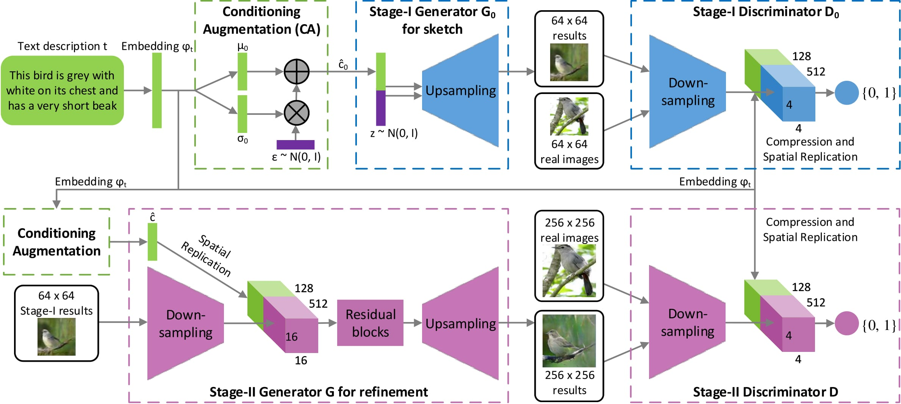 

### Conditioning Augmentation
The most significant difference between StackGAN and GAN-INT-CLS is the Conditioning Augmenetation process before feeding text embeddings into the generator. This innovation comes from the idea of variational autoencoder (VAE), where the latent space is mixed with random pertubations. These pertubations can be generated by the learned mean vector  and the learned variance vector . By diversifying a text embedding, the model becomes more robust.
For reversed image caption, let the text embedding be . We randomly sample latent variables from the distribution  as the representations of the original sentence. Equivalently, we get a bunch of training data points for each sentence. To avoid small learned variances, and make the distribution closer to the normal distribution, the KL divergence between the distributions should be minimized. According to [Auto-Encoding Variational Bayes](https://arxiv.org/abs/1312.6114), an extra term should be added to the loss function fo the generator:

### Stage I Generator

**Simple Version:**  
Stage I Generator first concatenates the augmented caption and noise vectors. Then, it performs upsampling through a fully connected layer followed by 4 deconvolutional layers, where the output feature map is 2× higher, 2× wider and 0.5× deeper than the previous layer. Note that the deconvolutional layers should be implemented by **tf.nn.conv2d_transpose** instead of **tf.layers.conv2d_transpose**; otherwise we can't specify the desired output shape.

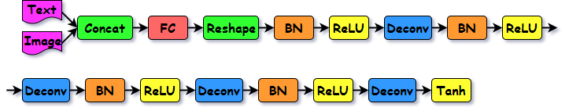

**Complex Version:**  
The deconvolutional layers in the simple version are replaced with **tf.image.resize_nearest_neighbor**. Moreover, few strided-1 convolutional layers with residual connection are added.

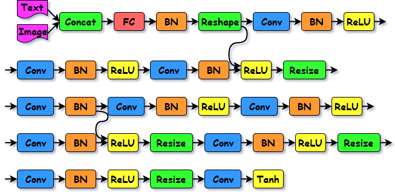

### Stage I Discriminator

**Simple Version:**  
It performs downsampling through 4 strided-2 convolutional layers, where the output feature map is 0.5× higher, 0.5× wider and 2× deeper than the previous layer. The replicated text embeddings are stacked along the channel dimension before being concatenated with the final output of the downsampling layers. Lastly, it compute the logits by a window-size convolutional layer (equvalent to a fully connected layer).

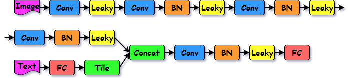

**Complex Version:**  
Compared to the simple version, a residual connection and 3 strided-1 convolutional layers are added.

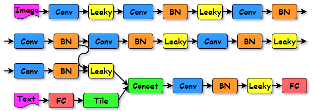

### Stage II Generator
It take the 64×64 images generated in Stage I as input. A structure the same as Stage I discriminator (simple) is used for downsampling; however, all leaky ReLUs are replaced by ReLUs. The role of the following 4 residual connections is to preserve the rough characteristics that was already learned in Stage I. Lastly, the upsampling is performed by **tf.image.resize_nearest_neighbor** and strided-1 convolutional Layers. The final images are 256×256.

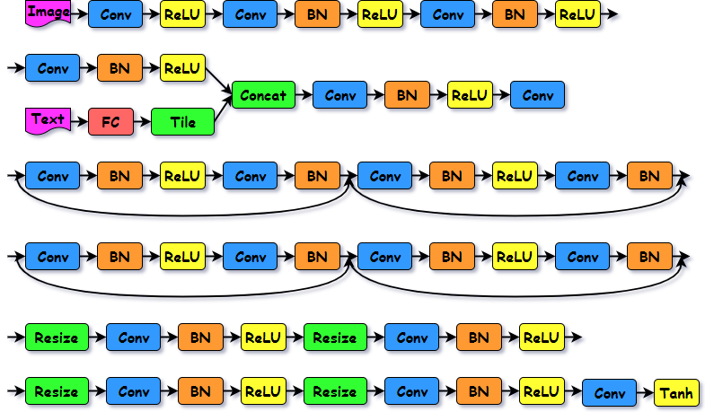

### Stage II Discriminator
Compared to the simple version, more strided-2 convolutional layers are added to shrink images to the size the same as Stage I. Moreover, several strided-1 convolutional layers and a residual connection is inserted before the logits layer.  

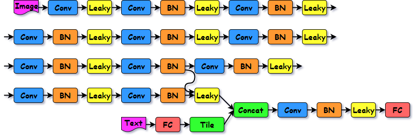

### Loss Function
Different from the vanilla generator loss, an additional KL divergence loss is needed as afrontmentioned. As for the discriminator loss, apart from the real loss (real image with real text) and fake loss (fake image with real text), the wrong loss (real image with fake text) is needed; otherwise, it's possible that the generator generates images well disregarding of the provided captions. In practice, we shuffle the mapping relationships between images and captions instead of generating fake captions.  
[Back to Top](#Top)

### Experiment

#### Setup

| Hyperparameter    | Value           | Hyperparameter     | Value            |
| ----------------- | --------------- | ------------------ | ---------------- |
| FC Initializer    | N(0, 0.02)      | Conv Initializer   | clip(N(0, 0.02)) |
| Gamma Initializer | N(1, 0.02)      | Deconv Initializer | N(0, 0.02)       |
| Z Dimension       | 100             | KL Loss Weight     | 2                |
| Learning Rate     | 0.002           | Optimizer          | Adam             |
| Decay Step        | 50              |  from Adam  | 0.5              |

#### Training Details
1.	Following the practice of GAN-INT, each sample of text embedding is the average vector of 4 random captions out of the 10 captions. Therefore, the total samples per image is .
2.	Using of **tf.layers.batch_normalization** automatically add two varibles, moving mean and moving variance to **tf.global_variables**. They need to be explicitly added to the variable list of the Saver to restore in the future. Also, the update operations for them are in **tf.GraphKeys.UPDATE_OPS**, so **tf.GraphKeys.UPDATE_OPS** should be included into the control dependencies.
3.	In Stage I, our architecture is **Stage I Generator + Stage I Discriminators**. In Stage II, our architecure becomes **Stage I Generator + Stage II Generator + Stage II Discriminators**, but only the Stage II parameters are updated during the optimization.
4.	We discover that using only uni-skip embedding of Skip-Thought generates images with greyish colors. So, we decide to use the 2400-dimensional Bi-Skip vector with the 200-dimensional vector generated from the embedding matrix in seq2seq.

#### Evaluation
Inception score is one of the metric to evaluate the quailty of GAN-generated images. It takes advantage of a inception network pretrained on ImageNet. A "good model" possesses two attributes: 
1. Low entropy  of the class distribution of a generated image. In other words, the inception network is pretty sure that the image is real and belongs to a specific class.
2. High entropy  of the class distribution over all generated images. In other words, the generated images are diverse enough such that no mode collapse has happened. Therefore, the inception score can be computed as:

Expanding the formula we get:
    

The first term is the negative entropy of , which we want to maximize. The last term is the cross entropy of , which we want to minimize. All in all, a good generative model should have a larger inception score.

In this project, we use a slightly different metric. The images are feeded into a VGG16 instead.  is replaced by the cosine distance between the logit vector and the ground truth vector.  is replaced by the reciprocal of standard deviation of all generated images. We want this modified score to be lower.

[Back to Top](#Top)

### Result
Each row of flowers are generated from one of the 8 captions with different initial noise:  
1. the flower shown has yellow anther red pistil and bright red petals
2. this flower has petals that are yellow, white and purple and has dark lines
3. the petals on this flower are white with a yellow center
4. this flower has a lot of small round pink petals
5. this flower is orange in color, and has petals that are ruffled and rounded
6. the flower has yellow petals and the center of it is brown
7. this flower has petals that are blue and white
8. these white flowers have petals that start off white in color and end in a white towards the tips

#### Complex Model
The original StackGAN paper use the complex generator discriminator. Nevertheless, in our experiments, we find out that the images generated are more unstable, the colors are more unnatural and the shapes are smoother. Furthermore, mode collapse happends easily after long enough training. The result is shown below:

After 50 epochs:

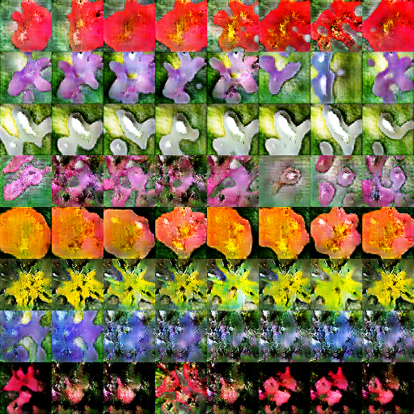

After 120 epochs:

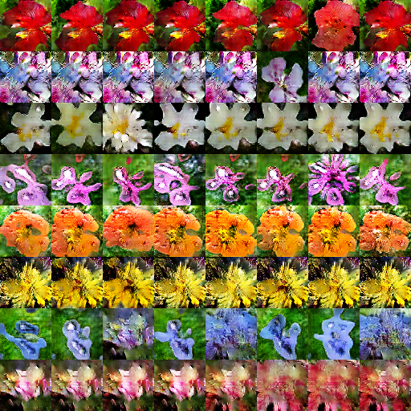

#### Simple Model
Based on our observations, the simple model always outperform the complex model.

After 5 epochs, the model learns the concept of color:

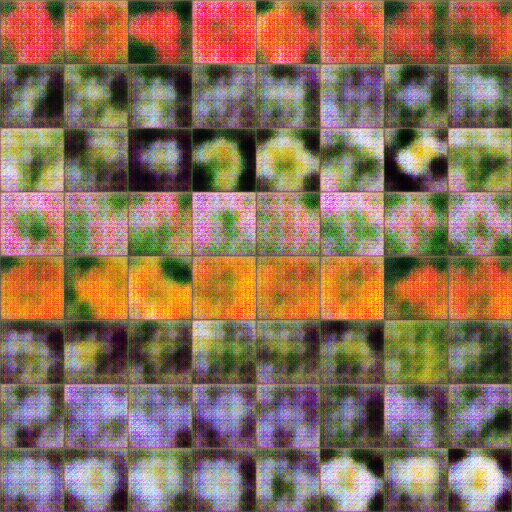

After 30 epochs, the shapes of flowers are roughly formed, but the flowers themselves are fuzzy:

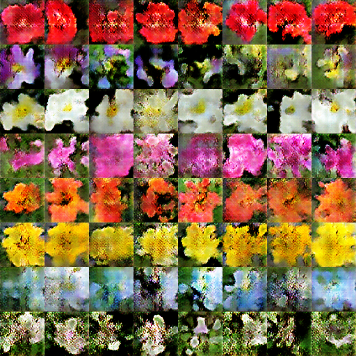

After 120 epochs, most of the flowers are realistic, but some are just color patches:

After 595 epochs, the good images are better, while the broken images stay the way they were. We believe caption 7 and caption 8 captions are too complicated for our model to generate desirable images. For example, Caption 7 uses an adjective clause for description. Caption 8 uses a longer sentence with details and rare words:

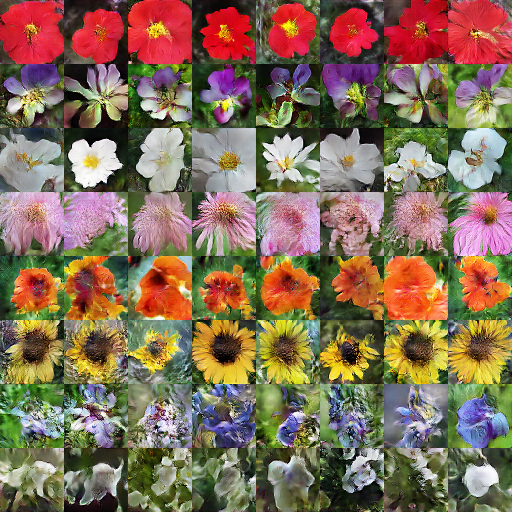

Flower evolution during Stage I training:

After 400 epochs of Stage II training, the flowers become more realistic. For caption 2, the "dark lines" parts of flowers ignored in Stage I show up. For caption 7, the images are more like flowers.

[Back to Top](#Top)

#### Testing Result
Our Stage I result reach 1.20 average score on the testing data. However, Our Stage II result scores low even we think the images are more realistic generally. We pick out the top-3 and bottom-3 images by their scores. We believe the scores can't truly reflect the quality of the generated images. Take image 148 as example, no matter in Stage I or Stage II, it can hardly be called a flower, yet it scores high.  

**Top 3 Images**  

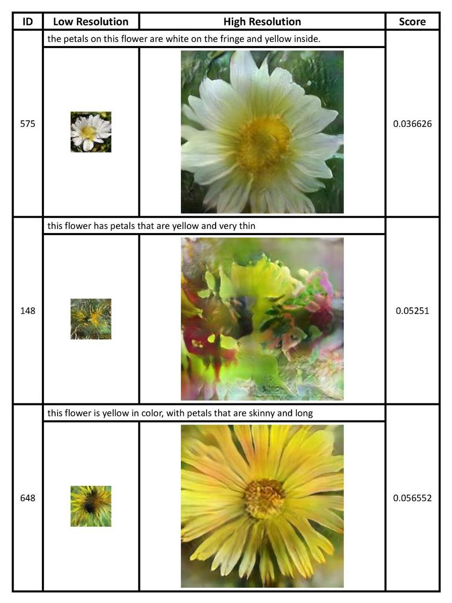

**Bottom 3 Images**  

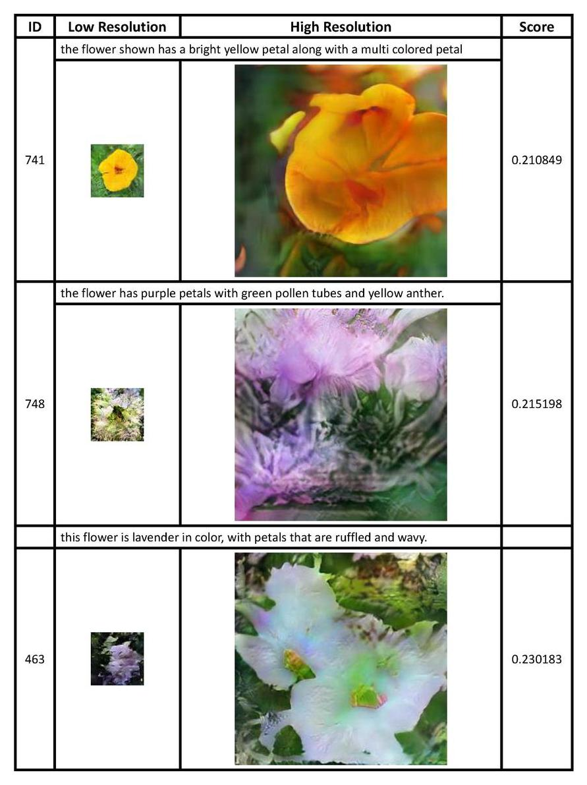

[Back to Top](#Top)

**Stage I v.s. Stage II**  
The diagram below shows the evaluation scores for all images in Stage I and Stage II, where the dark blue and dark red lines are the moving averages. The scores from Stage II are not necessarily better.
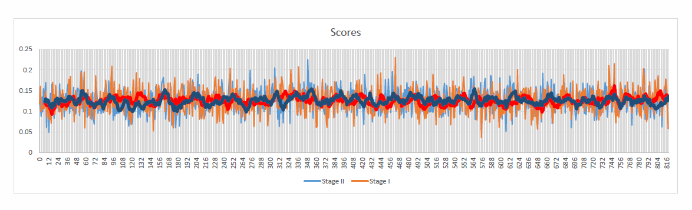

**Cherry-Picked Images**  

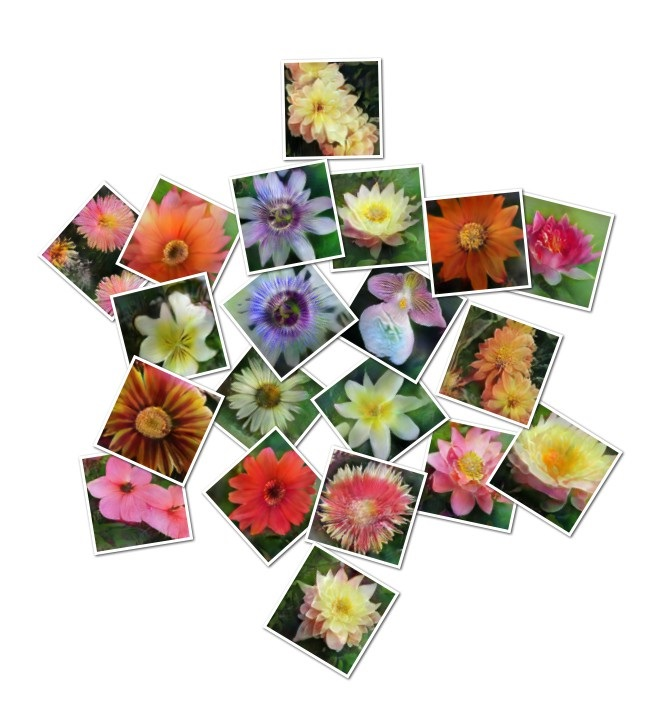

### Conclusion
The obstacles we meet in this project are summarized below. First, there are many implementation details for StackGAN need to be taken good care of. For example, some variables use the **tf.random_normal** initializers, while others use the **tf.truncated_normal** initializers. Interestingly, all layers in StackGAN omit the biases to avoid the sparse gradient problem as mentioned in [GAN Tips]( https://github.com/soumith/ganhacks).
While training a GAN model, its hard to tell the training status from the losses. Except for the drop of discriminator loss at the  beginning, the losses only fluctuate within a small range. So, we can't tell if a model has converged or not. Moreover, the quality of generated images differ significantly between consecutive epochs. Therefore, it's crucial to checkpoint the model every few epochs in oreder to find the best parameters. Lastly, the hyperparameters and the embedding types seem to have insignificant impact on the score. Maybe the arhitecture of GAN is the only factor that is important. 
We've tried to revise the loss function as what WGAN-GP did, but the model couldn't converge. This is due to the conflict of WGAN-GP loss and batch normalization. As described in the [WGAN-GP paper]( https://arxiv.org/abs/1704.00028), WGAN-GP penalizes the gradient that moves away from 1 by checking a line between the generated image space and the real image space. However, batch normalization make the samples within a batch relate with each other, causing the gradient penalty to fail. We've tried to replace batch normalization with layer normalization as the paper suggested, yet the the model didn't converge still. 
We believe our implementation still have room for improvement. One of the possibilities is to try other embedding methods like char-CNN-RNN, or use the flower images as the targets of an RNN encoder. Another possibility is to make use of the label that comes with each image by adding a classification head for our model as [AC-GAN]( https://arxiv.org/abs/1610.09585).

[Back to Top](#Top)
