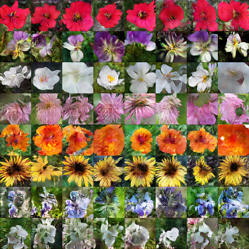

<h1>CS565600 Deep Learning DataLab Cup 4: Reverse Image Caption</h1>

<h3>Team22: SkyNet Zero&nbsp;&nbsp;&nbsp;&nbsp;&nbsp;</h3>

### Table of Contents

* [Problem Description](#Problem-Description)
* [Source Code Description](#Source-Code-Description)
* [Preprocessing](#Preprocessing)
    * [Image](#Image)
    * [Skip-Thought Vectors](#Skip-Thought-Vectors)
        * [Introduction](#Introduction)
        * [Text to Skip-Thought Conversion](#Text-to-Skip-Thought-Conversion)
    * [seq2seq Embedding](#seq2seq-Embedding)
* [Network Architecture](#Network-Architecture)
    * [Conditioning Augmentation](#Conditioning-Augmentation)
    * [Stage I Generator](#Stage-I-Generator)
        * [Simple Version](#Stage-I-Generator-Simple)
        * [Complex Version](#Stage-I-Generator-Complex)
    * [Stage I Discriminator](#Stage-I-Discriminator)
        * [Simple Version](#Stage-I-Discriminator-Simple)
        * [Complex Version](#Stage-I-Discriminator-Complex)
    * [Stage II Generator](#Stage-II-Generator)
    * [Stage II Discriminator](#Stage-II-Discriminator)
    * [Loss Function](#Loss-Function)
* [Experiments](#Experiments)
    * [Setup](#Setup)
    * [Training Details](#Training-Details)
    * [Evaluation](#Evaluation)
* [Result](#Result)
    * [Complex Model](#Complex-Model)
    * [Simple Model](#Simple-Model)
    * [Testing Result](#Testing-Result)
        * [Top 3 Images](#Top-3)
        * [Bottom 3 Images](#Bottom-3)
        * [Stage I v.s. Stage II](#StageI-vs-StageII)
        * [Cherry-Picked Images](#Cherry-Picking)
* [Conclusion](#Conclusion)

### Problem Description
Given a description of flowers. Our goal is to generate suitable 64×64 images according to the specified colors and shapes. We trained [StackGAN](https://github.com/hanzhanggit/StackGAN) on Oxford-102 Flower Dataset, which contains [102 categories](http://www.robots.ox.ac.uk/~vgg/data/flowers/102/categories.html) of flowers. Each flower comes along with ten captions describing its colors, shapes, size, texture, and positions of floral organs.

### Source Code Description
* DL_comp4_22_report.md: My report
* DL_comp4_22_report.html: Report in html
* Main.ipynb: Training data retrieval, data preprocessing, Training, Testing, etc
* seq2seq.ipynb: Converting captions to sentence embedding with seq2seq
* Preprocessing.ipynb: Generating training and Testing captions in desirable format
* train_captions.txt: Generated training captions
* test_captions.txt: Generated testing captions
* images/: Images used in this report
* images/: Equations used in this report

### Preprocessing

#### Image
The raw image sizes vary. Simply resizing the images to squares may alter the original aspect ratio. Fortunately, the flower itself usually locates in the center of the image, so we crop the longer side of the original image. Then do the reshaping. Take the original paper as reference, we modified our preprocessing flow as follows:

1.	Central cropping to a square with side length equals to the shorter side of the original image by **tf.image.resize_image_with_crop_or_pad**
2.	Scaling each sides to 76/64 times as big as the target image’s length of sides
3.	Random flipping horizontally by **tf.image.random_flip_left_right**
4.	Random cropping to target image size by **tf.random_crop**
5.	Normalizing each pixel to \[-1, 1\]

#### Skip-Thought Vectors

**Introduction**  
[Skip-Thought](https://arxiv.org/pdf/1506.06726.pdf) is an unsupervised learning model of sentence embedding. It abstracts the skip-gram model of word2vec to the sentence level, i.e., it predicts the context from the current sentence. The model of Skip-Thought consists of a GRU encoder and 2 GRU decoders. Feeding a sentence into the encoder, the decoders try to reconstruct the previous sentence and the next sentence.  
The authors proposed Vocabulary Expansion to expand the encoder’s vocabulary to words it has not seen during training. Let  be the word embedding space from some larger pretrained model like word2vec. Let  be the RNN word embedding space. Vocabulary Expansion tries to construct a matrix **W**, such that . Thus, any word in  can now be projected into  for encoding sentences.

**Text to Skip-Thought Conversion**  
We use the code from [here](https://github.com/paarthneekhara/text-to-image) to generate Skip-Thought vectors. First, download the model pretrained on BookCorpus from [here](https://github.com/ryankiros/skip-thoughts#getting-started). Then, use generate_thought_vectors.py to convert train_captions.txt and test_captions.txt into h5py format. For each caption, a 2400 dimensional vector is generated from the unidirectional encoder and another 2400 dimensional vector from the bidirectional encoder. According to the authors of Skip-Thought, the concatenation of the two vectors usually yields better results on various NLP tasks.

#### seq2seq Embedding
We train a LSTM Sequence-to-Sequence Model to enhance our sentence embeddings. The original sentence is fed into the encoder to get a encoded vector (the last hidden state). We want the decoder to reconstruct the exact sentence from this vector. Note that, attention mechanism is not applicable here, since it peeks the input instead of learning to reconstruct it. After convergence, we try the following methods to get the sentence embeddings:
1. Use **get_tensor_by_name** to retrieve the last hidden state of the encoder of embedding_rnn_seq2seq:

       encoder_output = tf.get_default_graph().get_tensor_by_name("seq2seq_rnn
           /embedding_rnn_seq2seq/embedding_rnn_decoder/rnn_decoder/rnn_decoder
           /output_projection_wrapper/output_projection_wrapper/lstm_cell/concat:0")
    
2. Extract the embedding matrix **embedding_wrapper/embedding:0** from the seq2seq model. The sentence embeddings can be generated by performing inner product on this matrix and the Bag-of-words representations of the original sentences.

       for var in tf.trainable_variables():
           if var.name == 'seq2seq_rnn/embedding_rnn_seq2seq/rnn/embedding_wrapper/embedding:0':
               embedding_op = var

[Back to Top](#Top)

### Network Architecture
The architecture of StackGAN is very similar to that of [GAN-INT-CLS](https://github.com/reedscot/icml2016) with some minor differences. 

 

### Conditioning Augmentation
StackGAN和GAN-INT-CLS最主要的差異在Text Embedding餵進Generator前，會先經過Conditioning Augmentation的過程，這個想法是來自於Variational Autoencoder，原本在Autoencoder中，每段文字只會被Encode成固定的一個Latent Vector，但實際上文字的變化是連續的，我們希望Latent Vector添加一些Noise之後，Decoder仍能正確的判斷文字的意涵，因此我們必須同時學出一個Mean Vector 和Variance Vector 。  
在Reversed Image Caption的應用裡，假設Text Embedding為，我們把從這個分布裡抽出來的點都當成原本Caption的一種表示法，這樣相當於我們對一張圖片多了很多的Captions，如此學到的Manifold也會更平滑。為了避免學到的Variance過小，我們希望學出來的分布越接近常態分佈越好，因此在Generator的Loss中我們必須添加一項KL Divergence來限制我們學到的分布，根據[Auto-Encoding Variational Bayes](https://arxiv.org/abs/1312.6114)的推導，Loss Function必須多出下列這一項：

### Stage I Generator

**Simple Version:**  
Stage I Generator為上圖中上方的藍色區塊，將Augmented Caption和Noise串接起來後，經過一層Fully Connected Layer後，透過4層Deconvolutional Layers做Upsampling，每層Output Feature的長寬都為前一層的2倍，但深度變為0.5倍。實作時得注意Deconvolutional Layers必須使用**tf.nn.conv2d_transpose**，並指定Output大小，不能用**tf.layers.conv2d**，否則輸出長寬不會如預期中變為2倍。

**Complex Version:**  
與Simple版本不同的地方在於，原本的Deconvolutional Layers被改成**tf.image.resize_nearest_neighbor**，並增加了幾層Convolutional Layers with Stride 1和Residual Connection，以增加模型的強度。

### Stage I Discriminator

**Simple Version:**  
Downsampling的部分我們將Target圖片餵入4層Convolutional Layers with Stride 2，每層Output Feature的長寬都為前一層的0.5倍，但深度變為2倍。由於每張圖是2D的，Text卻是1D的，因此我們把Text Embedding沿著Channel的方向平放，並複製成和圖片最後一層Output Feature長寬一樣的3D Tensor，串接起來後經過1層Window-size Convolutional Layer(等同於Fully Connected Layer)以取得Logits。

**Complex Version:**  
與Simple版本不同的地方在於，在Concatenation前多了一個Residual Connection和3層的Convolutional Layers with Stride 1。

### Stage II Generator
在Stage II我們餵進去的不是Noise而是Stage I產生的模糊圖片，因此我們先用和Stage I Discriminator (Simple)一樣的架構來降低Feature維度，差別在Leaky ReLU都被改成ReLU。比較特別的是，接著會經過4個Residual Block，由於Stage I我們其實已經學到花的顏色分布，因此我們希望透過Residual Connection多保留一些Stage I的特性，最後透過**tf.image.resize_nearest_neighbor**和Convolutional Layers with Stride 1將圖片長寬放大到Stage I的4倍。  

### Stage II Discriminator
我們需要經過更多層的Convolutional Layers with Stride 2，才能縮放到和Stage I最後一樣的大小，此外Stage II還多了幾層Convolutional Layers with Stride 1和Residual Connection來增加模型的強度，最後才和Text串接起來取得Logits。  

### Loss Function
有別於傳統的GAN Loss，在Generator Loss上我們必須多加一項前面Conditioning Augmentation產生的KL Divergence Loss；在Discriminator Loss上，除了需要原本2個Discriminators，分別餵入Caption和真實的圖、Caption和Generator產生的圖，還必須像GAN-CLS一樣，讓Discriminator判斷出當真的圖配上假的Caption是錯誤的，否則Generator可能只會產生擬真的圖片，卻不符合Caption的敘述，實作上我們在餵進這個額外Discriminator前，會將圖片隨機打亂順序，用來替代產生假的Captions。  
[Back to Top](#Top)

### Experiment

#### Setup

| Hyperparameter    | Value           | Hyperparameter     | Value            |
| ----------------- | --------------- | ------------------ | ---------------- |
| FC Initializer    | N(0, 0.02)      | Conv Initializer   | clip(N(0, 0.02)) |
| Gamma Initializer | N(1, 0.02)      | Deconv Initializer | N(0, 0.02)       |
| Z Dimension       | 100             | KL Loss Weight     | 2                |
| Learning Rate     | 0.002           | Optimizer          | Adam             |
| Decay Step        | 50              |  from Adam  | 0.5              |

#### Training Details
1.	如同GAN-INT的作法，每筆資料並非單純10組Captions各自配上對應的圖片，而會隨機從10組裡面抽4組做平均，我們假設兩組Embedding內插所表現的圖片是一樣的，如此可以產生組不同的Captions。
2.	由於使用tf.layers.batch_normalization會自動新增兩個變數：Moving Mean和Moving Variance，但這兩個變數不在tf.trainable_variables，而屬於tf.global_variables，因此必須另外取出再用Saver存在Checkpoint；此外，更新這兩個值的Operation在tf.GraphKeys.UPDATE_OPS中，必須在Optimize時添加成Dependency才會符合預期。
3.	在Stage I，我們的架構為Stage I Generator + Stage I Discriminators；在Stage II，架構為Stage I Generator + Stage II Generator + Stage II Discriminators，Stage I產生的圖片直接餵入Stage II Generator中，在Optimize時僅僅會更新Stage II部分的權重。
4.	我們發現若只使用Skip-Thought的Uni-Skip模型，最後產生的圖片會有種灰濛濛的感覺，若只使用Bi-Skip色彩會比較鮮豔，最後我們使用2400維的Bi-Skip Vecotrs和seq2seq產生的Word Embedding Table得到的200維向量作為我們的文字輸入。

#### Evaluation
Inception score是一種用來評量GAN產生圖片質量的方式，主要利用在Imagenet上Pretrain好的Inception Network來進行衡量，一個好的結果應有兩種特性:對一張圖所有Label的Entropy 低，代表產生出來的圖很明確屬於某一個類別，代表越接近真實的圖片，而非一張完全不像任何東西，或一張由各種類別融合在一起的模糊圖片；對所有圖片的Entropy 高，代表所有圖片的多樣性大，沒有Mode Collapse的現象發生，我們希望在不同的Caption底下每張圖都應該是不盡相同的，就算Caption很接近，給定不同的初始Noise也應該有不同的圖片被產生。於是Inception score的算式如下:  

將算式展開後我們可以得到:
    

前項是Negative Entropy of ，我們希望越大越好;後項是Cross Entropy of ，我們希望越小越好,所以整體上Inception Score越大表示結果越好。  

但實際上根據助教使用的程式碼，我們的理解是將圖片餵進VGG16，產生出來的Logits作為圖片的一種向量表示，使用Cosine Distance來計算產生結果和Ground Truth之間的差異，所以可以想像成Inception Score的，只不過越低越好；而另外計算所有圖片之間的Standard Deviation用來代替，取倒數之後也是越低越好。

[Back to Top](#Top)

### Result
所有的結果都使用助教預設提供的8組Captions:  
1. the flower shown has yellow anther red pistil and bright red petals
2. this flower has petals that are yellow, white and purple and has dark lines
3. the petals on this flower are white with a yellow center
4. this flower has a lot of small round pink petals
5. this flower is orange in color, and has petals that are ruffled and rounded
6. the flower has yellow petals and the center of it is brown
7. this flower has petals that are blue and white
8. these white flowers have petals that start off white in color and end in a white towards the tips

#### Complex Model
在原論文的Github上，預設是使用Complex Generator和Discriminator，不過實際測試後發現，一開始圖形的變化會比較不規則，比較平滑且會出現奇怪的光澤，而且到最後很容易出現Mode Collapse的現象，如下圖，因此最後我們只使用Simple的架構。  

第50個Epoch:

第120個Epoch:

#### Simple Model
第5個Epoch，可以注意到模型已經學到顏色的概念:

第30個Epoch，花的形狀已經漸漸看得出來:

第120個Epoch，部分文字的花已經非常逼真，但另外一些則呈現色塊混雜完全看不出是花的樣子:

第595個Epoch，可以發現原本就不錯的圖片變得更加逼真一些，但是原本壞掉的圖片仍沒有任何變好的跡象，可以觀察到第7,8個Caption的確是較複雜一些，Caption 7使用了形容詞子句來描述花瓣的顏色，而非常見的adj. + n.；Caption 8不但句子較長，還使用了Start off, End in等對花較細部的描述，且這幾個單字出現頻率並不高，因此學起來不這麼容易:

整個Stage I Training的過程:

進行完Stage II的Training，可以觀察到的確能有效的提升圖片的畫質，線條的細緻度和平滑度都更好，從Caption 2也可以觀察到Stage II的確有幫原圖添加細節的作用，本來在Stage I並沒有成功畫出Caption中Dark Lines的敘述；原本不成形的Caption 7也比較有花的特徵出現。
Stage II 第400個epoch:

[Back to Top](#Top)

#### Testing Result
在助教提供的Testing Data上，我們Stage I最好的結果可以達到平均1.20分左右，我們發現即使加上Stage II來產生256×256的圖片，肉眼看起來好很多，但測出來精準度仍然差不多，甚至較差。  
下面我們分別取出在Inception Score上表現最好和表現最差的3組圖片，我們發現Inception Score和我們肉眼觀察的結果仍有一段差距，比如第148張圖，無論在Stage I或II怎麼看都不是花，分數卻非常高；第741張圖在低畫質的情況下看起來還可以，分數卻最差，到高畫質時才真正完全失真，這可能代表這張Generator產生的圖可能有我們肉眼看不出來的Noise，導致Inception模型無法正確判斷其內容，Stage II Generator也無法將他的畫質提升到更好。  

**Top 3 Images**  

**Bottom 3 Images**  

[Back to Top](#Top)

**Stage I v.s. Stage II**  
下圖統計了每張圖片在Stage I和Stage II的分數，可以發現有些變高有些變低沒有一定的規律，深紅線和深藍分別是原始資料的移動平均：

**Cherry-Picked Images**  

### Conclusion
這次遇到比較大的困難有以下幾點，首先，StackGAN的實作有很多細節要注意，比如有些變數用**tf.random_normal**做初始化，有些用**tf.truncated_normal**等等，另外比較特別的是，無論是哪一種Layer，在架構中都是不加Bias的，我覺得這也符合在[GAN Tips]( https://github.com/soumith/ganhacks)中提到的必須避免Sparse Gradient，以增加Training的穩定性。  
在Training時，也很難透過Loss的變化來觀察模型的效果，除了一開始Discriminator的Loss會逐漸下降之外，後面無論Discriminator還是Generator的Loss都不會有明顯的變化，無法作為收斂的判斷依據；GAN產生的圖片也不一定Train越久就會越好，必須每個一段時間把圖片存下來才能找出最好的結果；此外，我們發現無論怎麼調整我們的參數、Embedding方式對分數的影響好像都不顯著，有可能影響GAN效能主要還是在模型架構的設計。  
我們一開始曾嘗試把Loss Function改為WGAN-GP，但發現Train不起來，參考了[原始論文]( https://arxiv.org/abs/1704.00028)才發現，WGAN-GP的Loss中是懲罰Generator產生的Distribution和真實圖片Distribution中間的一點，相當於一次只看一組資料，而Batch Normalization會加入一個Batch裡面每筆資料彼此之間的聯繫，導致Gradient Penalty失效，原論文建議可用Layer Normalization取代，但我們測試後還是Train不起來。  
雖然我們最後做出來的結果還算可以，但和原論文同樣Caption產生的圖片來比好像還差一段距離，可能是有小地方沒注意，或由於原論文使用char-CNN-RNN Text Encoders的關係。另外我們還可以改進的地方包括RNN模型，一開始沒想到像助教一樣用圖片當成RNN的Target，這邊感覺還有很多方法可以試；另外由於Flower Dataset每張圖其實都有Label，但這次我們並沒有使用到，若可以參考[AC-GAN]( https://arxiv.org/abs/1610.09585)增加Classification的Layer，我想也能更進一步改善最後的結果。  

[Back to Top](#Top)
