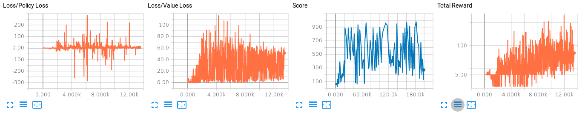
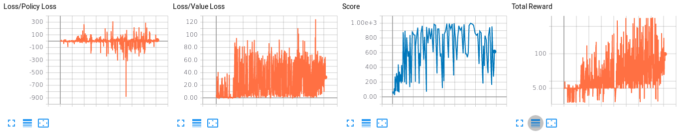

<h1>CS565600 Deep Learning DataLab Cup 5: Deep Reinforcement Learning</h1>

<h3>Team22: SkyNet Zero&nbsp;&nbsp;&nbsp;&nbsp;&nbsp;Members: 105062635 吳浩寧 105062514 張嘉宏</h3>

### Table of Contents

* [Problem Description](#Problem-Description)
* [Source Code Description](#Source-Code-Description)
* [Preprocessing](#Preprocessing)
* [Network Architecture](#Network-Architecture)
    * [Asynchronous Advantage Actor-critic (A3C)](#A3C)
        * [Actor-critic Methods](#Actor-critic-Methods)
        * [Advantage Function](#Advantage-Function)
        * [Asynchronous Framework](#Asynchronous-Framework)
        * [Parallel Programming with Python](#Parallel-Programming-with-Python)
    * [Deep Q-Network (DQN)](#DQN)
        * [Memory Replay](#Memory-Replay)
        * [Dueling Network](#Dueling-Network)
        * [Double DQN](#Double-DQN)
* [Result](#Result)
    * [Setup](#Setup)
    * [Analysis](#Analysis)
* [Conclusion](#Conclusion)

### Problem Description
這次我們必須使用Reinforcement Learning的方法，來學習如何讓電腦自己玩Flappy Bird。RL透過與環境不斷的互動，來更新自己的策略，以達成使用者設定的目標，非常適合解決有固定目標的小遊戲。在Flappy Bird遊戲中，我們必須操控一隻小鳥，來穿過一系列連續出現在銀幕的水管中間，每個時間點只有兩種動作可以選擇，往上跳或不做動作讓小鳥往下掉，一但撞到水管、天花板或地板，遊戲就結束了，而此時累積通過的水管數量就是自己的得分。

### Source Code Description
* DL_comp5_22_report.ipynb: Report檔
* DL_comp5_22_report.html: 建議助教閱讀此檔!!! 圖片好像有時怪怪的...
* A3C.ipynb: 使用A3C來Train Flappy Bird的主程式
* DQN.ipynb: 使用DQN來Train Flappy Bird的主程式
* A3C_Best.webm: 測試時最好的結果，可以飛過約800組水管
* images/: 存放圖片

### Preprocessing
我們這次使用的資料就是每個時間點的遊戲畫面，由於Flappy Bird的背景圖案對遊戲本身沒有影響，所以助教已經幫我們把背景去除掉；此外畫面的顏色和遊戲也沒關係，比較重要的是物件彼此相對的位置，因此進行Training時都是使用灰階的畫面，每筆資料都採用連續4個畫面，如此可以增加資料時序上的關係，針對2種我們使用到的方法:A3C和DQN，我們分別將畫面縮放到84×84和80×80。

[Back to Top](#Top)

### Network Architecture

#### Asynchronous Advantage Actor-critic (A3C):

#### Actor-critic Methods:
A3C的其中一個A代表Actor-Critic，是一種結合了Value-based與Policy-based的方法，Actor透過Agent每次與環境互動得到的經驗，來更新自己的參數，以期能最大化最後的Total Return；同時Critic會根據每個輸入的State，衡量它們的價值，也就是從這個State開始後，預期還能拿到多少的Cumulated Reward 。  
在[A3C](https://arxiv.org/abs/1602.01783)原本的論文中，是使用Shared Network的架構，因為Actor和Critic都使用原本遊戲畫面得到的特徵，因此可以共用前幾層Convolutional Layers學到的資訊，不須要真的有2個Networks，只需使用1層Fully Connected Layer來得到Value，另外1層FC Layer加上Softmax，以取得現在這個Policy下每個Action的機率。總之Critic的Loss可以表示成，讓我們Network預測出的Value和實際互動時得到的Cumulated Reward越接近越好。

#### Advantage Function:
對於Actor，我們的原本的Loss Function應該是是，其中後面一項是Monte-Carlo的方法來估計Q，由於我們一次跑完一整個Episode，以取得每個時間點的Reward，如此可以得到Unbiased估計，但每一步產生的Variance累積起來就很可觀，因此透過減去一個和無關的Baseline，來降低後項的大小，就能同時降低Variance，而我們用Critic得到的V，就是一個非常好的Baseline，既能降低Variance，又能正確的導引Actor往正確的方向更新，而就是某個Action的Advantage Function，實作上我們用實際互動時得到的Cumulated Reward來估計，用目前Critic的參數來估計，最後的Loss Function會變為。

#### Asynchronous Framework:
當我們使用同個Episode來產生Training Data，由於每個Time Step每一步都和前一步有關，因此產生的資料並不是i.i.d.，有可能造成模型收斂到Local Minimum，因此我們可以使用多個Threads同時和環境互動，每個Thread可以使用不同的Exploration Policy，甚至和不同的環境互動，如此就可以得到比較獨立的資料分布，就不需要像DQN多使用一個Replay Buffer來記錄過往的經驗，使用Multi-thread的方法更可以加快Training速度。  
實作上我們有1個Shared Global Network和許多個Worker Networks，每個Worker會和不同的Random Seed初始的環境互動，每經過個Time Steps就會從Global Network取得參數，計算出筆資料的Gradients，再將這些Gradients傳回Global Network來更新模型，因此對每個Network我們新增了將設置Variables和Gradients的Tensorflow Operation:

    self.set_network_params_op = []
    for idx, param in enumerate(self.input_network_params):
        self.set_network_params_op.append(self.network_params[idx].assign(param))

    self.grad_placeholder = [tf.placeholder("float", shape=grad.get_shape()) for grad in self.gradients]
    self.apply_grads = optimizer.apply_gradients(zip(self.grad_placeholder, local_vars))
    
另外我們的寫法和原論文有點差異，就是我們會先進行一個完整的Episode，或遊戲進行超過設定的時間限制，才進行更新模型的步驟，而非邊更新模型邊進行Exploration，如此可以得到準確的Cumulated Reward，若是到達時間限制遊戲卻還沒結束時，我們會用Critic估計出的V值來當作Bootstrapping Value以計算Cumulated Reward。   
    
    def discount_reward(x, discount_rate, bootstrap):
        discounted_r = np.zeros(len(x) + 1)
        num_r = len(x)
        for i in range(num_r):
            discounted_r[i] = x[i] * math.pow(discount_rate, i)
        discounted_r[num_r] = bootstrap
        discounted_r = np.cumsum(discounted_r[::-1])
        return discounted_r[1:][::-1]
        
    if env.game_over():
        discounted_reward = discount_reward(rewards, agent.discount_factor, 0)
    else:
        esti_V = agent.get_esti_V(input_screens[-4:])   
        discounted_reward = discount_reward(rewards, agent.discount_factor, esti_V)

#### Parallel Programming with Python:
我們使用了Python的**multiprocessing** Package，並使用**multiprocessing. Queue**來進行Thread之間資料的溝通，我們建立一個central_agent，負責把Global Network的參數傳送給每個Worker，並收集這些Workers計算完的Gradients，並每隔一段時間就把Global Network的參數儲存起來。  
每個worker_agent會有自己的Environment **ple.PLE**，會不斷的進行Exploration，最多只進行16000個Time Steps，另外我們讓其中一個特殊的Worker負責IO的工作，比如將遊戲過程寫成影片或記錄一些數據；它永遠進行Exploitation，也就是選擇Actor Network輸出裡面機率最大的Action，而非從機率分布中做抽樣。  
最後我們用evaluate_agent不斷執行助教的Evaluation Function來計算分數。

[Back to Top](#Top)

#### Deep Q-Network (DQN):
DQN結合了Deep Learning以及Q learning的優勢，使用Neural Network去近似Q值，就不需要使用Q table記錄所有的State及Action，便能處理更複雜的問題；這次我們使用的架構主要3層的Convolution Layers以及2層FC Layers所組成，輸出的結果會是對應所有Action的Q值，在Training時我們就可以用目前估計的Q值當成Target，進行TD Estimation來更新Network的參數，並依據ε-greedy的方式以一定的機率進行Exploration。但若單純照前述方法，可能會因為估計值的不精準，加上更新過於頻繁，造成Training的不穩定，因此我們會額外複製一個Target Network，固定它的參數，以它估計出
的Q值來更新原始的Online Network，隔較久的一段時間才把Online Network的參數在複製給Target Network。

#### Memory Replay:
如同前面在Asynchronous Framework中提到，用同一個Episode產生的資料會產生無法收斂的問題，另一種解決方法就是使用Memory Replay，每次進行完一次Episode，就把這次得到的經驗放入一個夠大的Memory Buffer，在從中隨機抽取部分樣本來進行Gradient Decent，另外在一開始Buffer還是空的時候，我們也得先花一些時間只進行Observation，也就是不更新Network只不斷的進行Exploration，來填滿Buffer。

#### Dueling Network:
Dueling Network和傳統DQN的差異在原本的第2層FC Layer又分支成2個FC Layers，分別為State Value表示狀態的好壞，以及Advantage表示在這狀態下各個Action的相對好壞程度，這樣的設計可以知道到那些狀態比較有價值，而不需要學習每個狀態下各動作的影響，主要是因為遊戲中，很多狀態下不論採取何種動作都不會影響結果，在這些情況下，計算狀態的好壞會比各動作的好壞有意義。
根據Advantage Function的式子，我們可以找到一個常數變量，使得V與A值不是唯一解，為了使訓練比較穩定，我們在Advantage扣除Advantage的平均，用以固定變量:

#### Double DQN:
在原先的DQN中，Action的Q值普遍會被高估，且若高估的差值不是平均的，那就可能選取到非最優的Action	，使得我們很難找到最好的解法。實作上，我們將Q Function改為下式:先從Online Network中找到Q最大的Action，再利用這個Action從Target Network找出對應的Q值，這樣的方法讓我們依舊採取Greedy的方式在Online Network找尋最大值，但以Target Network來估計Q，因為這Q在兩個Network中同時被高估的機率較低，可以有效避開前述現象。

[Back to Top](#Top)

### Result

#### Setup

| Hyperparameter    | Value           | Hyperparameter     | Value            |
| ----------------- | --------------- | ------------------ | ---------------- |
| # stack           | 4               | Entropy Weight     | 1e-2             |
| Learning Rate     | 1e-4            | Optimizer          | Adam             |
| Gradient Clipping | Global Norm: 40 | Batch Size         | 32               |
| Max # Steps       | 16000           | # Thread           | 16               |

#### Analysis
使用助教提供的Evaluation Function時，會得到我們Train好的Agent在100個不同的Random Seeds底下，玩Flappy Bird存活的時間，而最長經過1000個Time Steps遊戲就會強制結束，當我們使用Dueling DQN時，經過5000個Epochs就能得到平均812.42的分數；不過我們發現A3C普遍的表現比較好，甚至可以在每個環境都達到1000分，因此我們主要以A3C來進行實驗。  
我們統計了以下幾個數據，使用1個永遠進行Exploration的Agent，每經過1個Episode就計算平均的Value Loss、Policy Loss和這次得到的Total Return，另外1個Evaluation Agent不斷Restore最新的參數，看可以得到多少分數，由於每個Episode跑得時間不一定，所以並不是等間隔的衡量。我們測試了兩種Network架構，分別使用A3C原本論文中的2層Convolutional Layers和DQN的3層Convolutional Layers並進行200000個Episodes的Training，總共要花約24小時。  

**2 Layers:**

**3 Layers:**

從Loss來看，可以發現不論是Value Loss還是Policy Loss浮動都非常大，沒什麼規律，不像以前做Classification時會有明顯收斂的現象，大致上可以看出Policy Loss以0為中心做大幅震盪，Value Loss則有漸漸增大，但Variance降低的趨勢；就Evaluated Score來看，大約經過20000個Episode就可以得到平均800以上的分數，但兩者的浮動都非常劇烈，並沒有嚴格遞增的趨勢，但明顯可以看出3層架構比2層架構要好；圖中最右邊Total Return的Y軸有取過Log，可以看出經過越多個Episodes，低於5分(連第一根水管都過不了)的狀況越來越少，而封頂(16000分)則越來越頻繁，尤其是3層的架構，雖然震盪的情況仍非常明顯。

[Back to Top](#Top)

### Conclusion
分析我們的實驗結果震盪如此劇烈的原因，第一可能是模型尚未收斂，由於Flappy Bird每種畫面都是一個State，任兩根連續的水管之間的組合就約有數萬種，導致要走遍所有的States幾乎不太可能，每段時間看到的Episodes差異性又非常大，導致模型在不同的Local Minima跳來跳去。我們也注意到在Training時幾乎大部分的時間都沒辦法超過100分，可能是當我們在進行Exploration是從機率分布中去取樣，因此容易選到錯誤的Action，必須花更久的時間讓模型收斂；再者我們Training時是每宣告完一個Environment，就不斷進行遊戲下去，每次小鳥死亡後接下來的畫面就是全新的，但助教提供Evaluation Function是每次都重新建立的一個Environment，因此起始的狀態變異性少非常多，我認為若更改我們的Training方式和Evaluating方式一樣的話，可能會有更穩定的結果。  
在搜尋參考資料的過程中，我們發現OpenAI有提出一些改進的模型架構，比如[A2C]( https://blog.openai.com/baselines-acktr-a2c/)，是Synchronous版本的A3C，會等每個Worker Agent進行完自己的Episode才同時更新Global Agent的參數，據說效果比A3C更好。我們應該也要嘗試改變Optimizer或Weights初始方式對模型的影響，這些都是以後可以改進的方向。  
這次遇到比較大的困難就是Reinforcement Learning的Learning Curve基本上是一條S形的曲線，在剛開始Training的效果非常不顯著，比如一開始要Flappy Bird以隨機的方式通過第一根水管是非常困難的，自然Actor也很難學到這些Actions是好的；最後我們在進行Evaluation時的分數也起起伏伏，感覺有點隨機的因素在裡面，但看到有些小鳥可以通過800組水管仍是滿興奮的。

[Back to Top](#Top)
